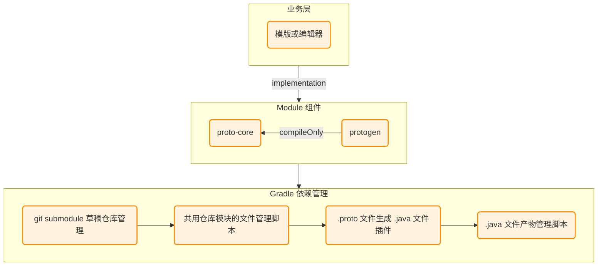
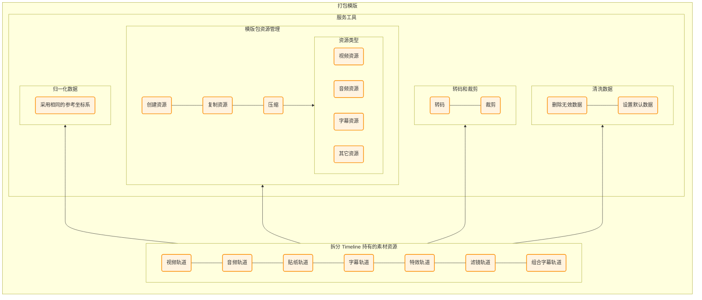
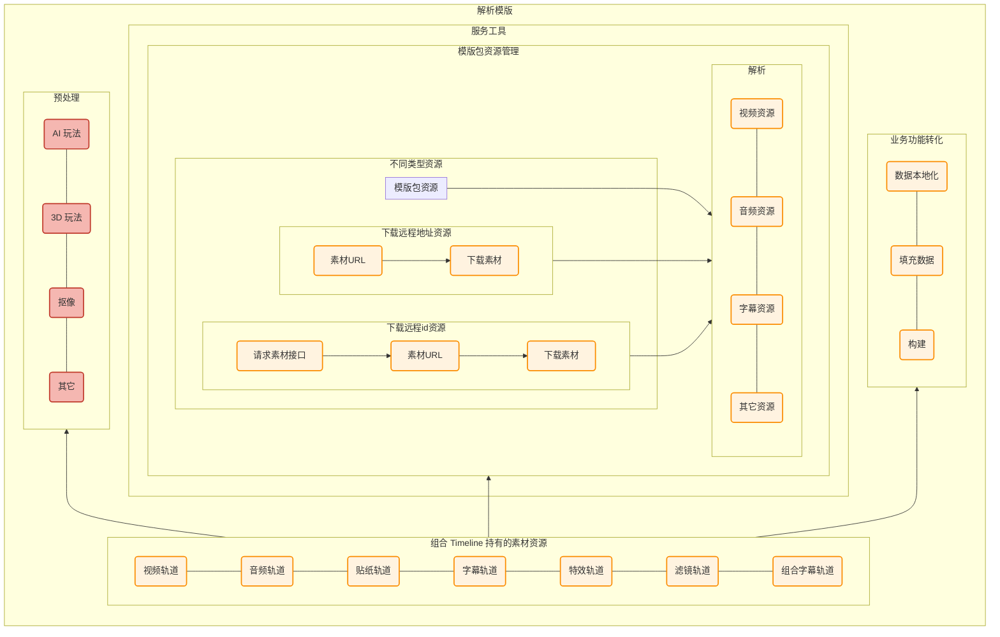
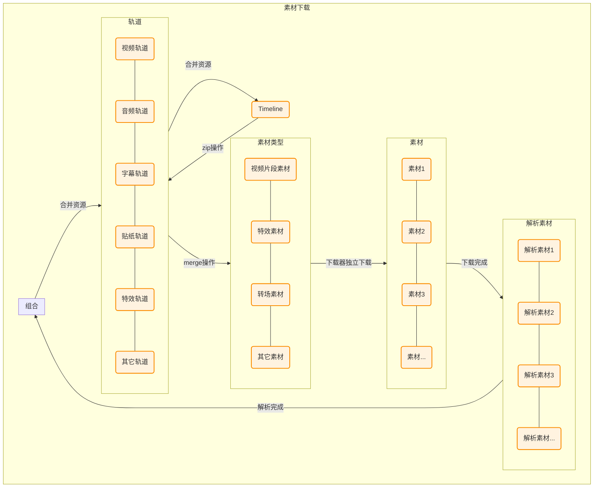
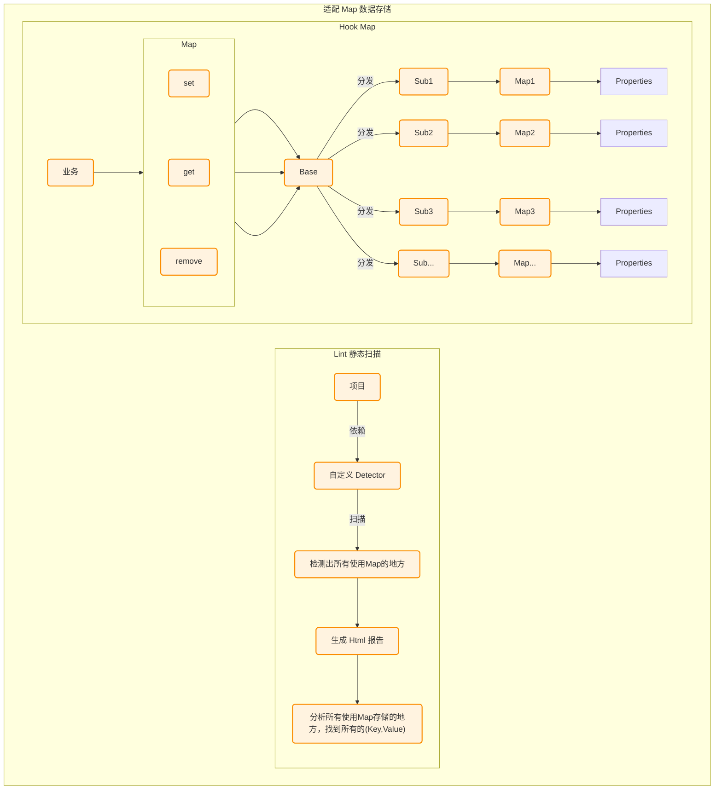

## 简介

情境：UP 主可以在端内进行编辑，然后上传到视频模版库，从而增加模版创作人数和提升模版质量，最终完成稿件的渗透和转化。

任务：模版业务主要包含模版UP主生产，UP主投稿，人工和机器审核，用户消费，用户投稿五大流程，我负责UP主生产和用户消费，也就是模版制作和还原。

行动：熟悉编辑器所有业务功能和编辑器引擎所有功能，制定模版生产，以及在必剪、哔哩哔哩 Android 和 iOS 端消费技术方案，主导并实施。

结果：支持UP主在必剪生产模版，用户在必剪、哔哩哔哩Android 和 iOS 端消费模板，并支持年报等运营活动，提升稿件量。

UGC 视频模版业务**重点**：**视频模版生产和还原效果一致**。

## 技术方案

### 草稿统一

目的：双端生成的编辑器草稿数据模型和格式一致。


编辑器有130多个原子产品功能，需要使用800多个字段描述这些功能，这里选择使用 `Protobuf` 来做草稿的存储和读取。选择 `Protobuf` 不选择 `JSON` 的原因主要有：数据类型，跨语言支持，向前/向后兼容。

|  | Protobuf | JSON |
|------|----------------------|------------|
| **跨语言支持** | 代码自动生成，强类型 | 解析库多，但容易出错 |
| **数据结构** | 强类型，编译时校验 | 弱类型，容易类型错误 |
| **向前/向后兼容** | 向后兼容，新字段不影响旧版本 | 兼容性差，字段变动可能解析失败 |

由于 `Protobuf` 文件是二进制格式，在阅读上同时存在优点和缺点。新增 python 脚本，自动将草稿 `draft.pb` 转换为 `draft.json`，方便阅读排查草稿生成和消费问题。

在 Android 中集成`草稿 proto 仓库` 和 `com.google.protobuf`插件：


### 模版生产

目的：生成双端可消费视频模版包，模版包包含编辑器草稿 draft.pb，资源文件。

模版生产流程：兼容业务功能逻辑 &rarr; 坑位配置 &rarr; 业务功能转化 &rarr; 数据模版化 &rarr; 转码和裁剪 &rarr; 清洗数据 &rarr; 归一化数据 &rarr; 模版打包（视频，音频，图片，其它，草稿PB资源）。

- 转码和裁剪：音视频转换为双端都支持的格式，音视频按需做裁剪，防止文件冗余。
- 清洗数据：清除端内相关的数据和无效数据。
- 归一化数据：采用相同的参考坐标系。
- 资源打包：本地资源压缩打包，远程资源存储资源id。

模版生产接口定义：

```kotlin
/**
 * 打包模版包
 * @param timeline 当前时间线
 * @return 本地模版包路径
 */
@WorkerThread
fun packageTemplate(timeline: Timeline): String{
    
}
```
模版打包架构设计：




### 模版消费

目的：根据模版包地址还原模版，效果和生产时一致。

模版消费流程：下载模版 &rarr; 解析模版 &rarr; 解析草稿PB &rarr; 下载资源（视频，音频，图片，其它）&rarr; 数据本地化 &rarr; 业务功能转化 &rarr; 组装数据 &rarr; 填充坑位 &rarr;构建编辑器环境 &rarr; 裁剪填充片段 &rarr; 铺轨展示。


模版消费接口定义：
```kotlin
/**
 * 解析模版包
 * @param url 模版包地址
 * @return 时间线
 */
@WorkerThread
fun parseTemplate(url: String): Timeline {

}
```
模版解析架构设计：



模版素材下载设计：


模版解析涉及两个重要的问题：
- 远程资源下载失败问题：重要模版，不允许进入；否则选用兜底资源。
- 效果还原正确问题：重要模版，不允许进入；否则选中默认属性。

对于这两个问题还需要监控的是：资源下载成功率（收集下载失败的素材），和模版还原成功率（收集 Timeline 的复杂度）。

## 统计数据

UGC 视频模版业务需要统计的数据有：
1. 模版下载成功率，下载耗时，下载大小
2. 素材下载成功率，下载耗时，下载大小
3. 下载模版和素材的成功率，失败原因
5. 模版还原成功率

### 模版下载成功率

下载成功率，如：

| 日期 | 成功率 |
| --- | --- |
| 20220901 | 99.28% |
| 20220902 | 99.23% |

下载耗时（90分位），如：

| 日期 | 耗时 |
| --- | --- |
| 20220901 | 1,707ms |
| 20220902 | 1,642ms |

下载大小（90分位），如：

| 日期 | 耗时 |
| --- | --- |
| 20220901 | 1.44MB |
| 20220902 | 1,47MB |

### 素材下载成功率

下载成功率，如：

| 日期 | 字体 | 字幕模版 | 字幕动画 | xx |
| --- | --- | --- | --- | --- |
| 20220901 | 98.72% | 99.11% | 99.52% | xx.xx% |
| 20220902 | 98.69% | 98.64% | 99.56% | xx.xx% 


下载耗时（90分位），如：

| 日期 | 字体 | 字幕模版  | 字幕动画  | xx  |
| --- | --- | --- | --- | --- |
| 20220901 | 9,227ms | 6,448ms | 5,837ms | x,xxxms|
| 20220902 | 7,996ms | 7,722ms | 6,912ms | x,xxxms |

下载大小（90分位），如：

| 日期 | 字体 | 字幕模版  | 字幕动画  | xx  |
| --- | --- | --- | --- | --- |
| 20220901 | 8.23MB | 6.24MB | 6.31MB | x.xxMB |
| 20220902 | 8.15MB | 6.11MB | 6.51MB | x.xxMB |

### 下载模版和素材的成功率

下载模版和素材的成功率，如：

| 日期 | 成功率  | 成功数 | 平均耗时 |  用户数  |
| --- | --- | --- | --- | --- |
| 20220901 | 0.9972 | 71699   | 1.89s | 71903 |
| 20220902 | 0.9975 | 77906   | 1.55s | 78103 |

下载失败原因，如：

| # | error_msg    | count |
| - | ------------ | ----- |
| 1 | Context is invalid   | 25     |
| 2 | The request timed out | 3     |
| 3 | download error errorCode:400   | 4     |
| 4 | checkState error  | 58     |
| 5 | 其它           | x


### 模版还原成功率

模版还原成功率（阈值 97.00%），如：

| 日期 | 成功率  | 开始次数 | 成功次数 |  失败次数  |
| --- | --- | --- | --- | --- |
| 20220901 | 99.90% | 36,988    | 36,951 | 37 |
| 20220902 | 99.88% | 35,708   | 35,701 | 7 |


## 难点

### 草稿统一

做 UGC 视频模版时，在草稿统一遇到的难点主要有两点：
1. 原业务中使用了 Map 数据存储。
2. 在本地和 CI/CD 构建时，能正确依赖 proto 仓库的 java 产物。

适配 Map 数据存储流程图（lint 插件源码：[https://github.com/WJRye/lint_mthod_collector.git](https://github.com/WJRye/lint_mthod_collector.git)）：


依赖 proto 仓库 java 产物：这里主要编写 gradle 脚本，在 gradle 中执行 git 命令，和自定义 task 任务。


## 总结

UGC 视频模版业务：
- 耗时很长：从开发到上线花费了3个月以上的开发时间，主导并实施，需要**熟知业务每个节点和编辑器引擎每个功能**，才能把控进度和风险。
- 跨端跨平台：数据的生产和消费，需要考虑到各端各平台兼容性，比如选择 protobuf，清洗数据，归一化数据等。
- 技术目标：制定下载成功率，还原成功率等，熟悉每个流程节点细节，制定合理目标才能保证质量。
