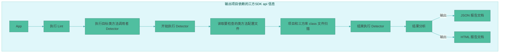
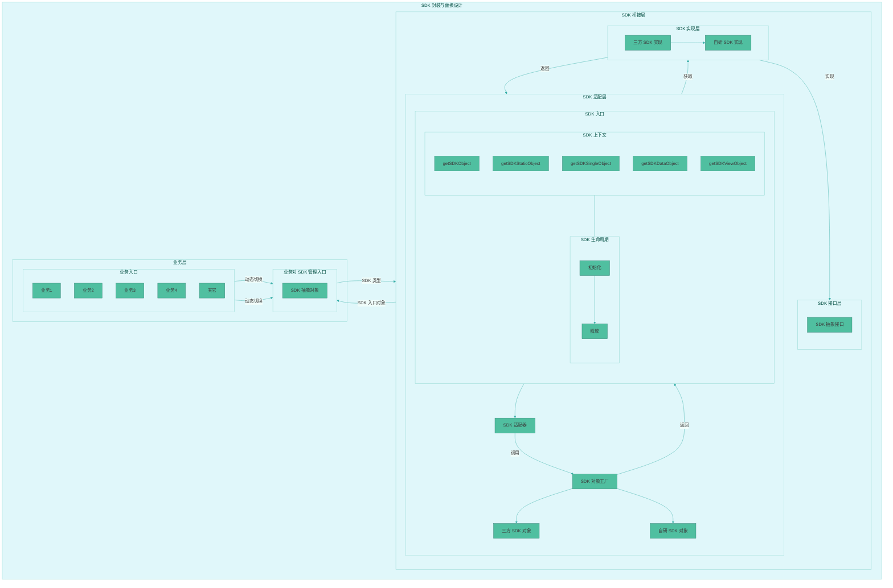
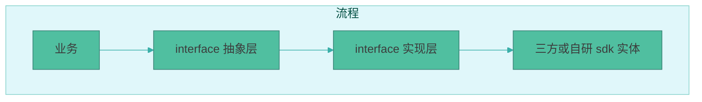

## 简介

情境：技术需求，将哔哩哔哩和必剪中的视频编辑器引擎SDK从三方切换为自研。

任务：负责将自研视频编辑器引擎SDK从单点业务接入，并推广到所有业务。

行动：业务选型，SDK摸底，制定技术方案，主导并实施。

结果：自研视频编辑器引擎SDK在哔哩哔哩和必剪 Android和 iOS 端支持视频编辑，UGC视频模版，年报活动等所有业务。

视频编辑器引擎 SDK 的封装与替换**重点**：**业务层对 SDK 无感知**。

## 业务选型

因为之前的三方视频编辑器引擎SDK已经在项目的所有业务中运行很多年了，而自研视频编辑器引擎SDK作为首次开发首次在项目中实践，所以只能选择某个业务进行实验。

业务选型需要评估的核心要点有：
- 研发成本：从UI操作和引擎功能评估；
- 影响用户数：从PV和影响等级评估；
- 开发节奏：分期实现，第一期，第二期，第X期等；
- 灰度上线方案：素材维度，原子能力维度，系统特性维度；

研发成本，如：

| 场景 |  UI 操作 |引擎功能 |
| --- | --- | --- |
| 业务1 | 少 | 全部|
| 业务2 | 多 | 全部|
| 业务3 | 中 | 部分|

影响用户数，如：

| 场景 |  PV |影响等级 |
| --- | --- | --- |
| 业务1 | 3w | 中 |
| 业务2 | 10w | 高|
| 业务3 | 5w | 中|

开发节奏，如：

| 节奏 |  实现目标 |
| --- | --- |
| 第一期 | SDK桥接层上线，支持三方和自研SDK的动态切换，保留原业务逻辑并使用原三方SDK |
| 第二期 | 业务X接入，覆盖业务X的所有链路节点，进行灰度 |
| 第三期 | 推广覆盖其他业务，进行灰度，最后全量 |

灰度上线方案，如：

| 维度 |  实现目标 |
| --- | --- |
| 素材| 根据自研视频编辑器引擎支持素材类型进行灰度 |
| 原子能力 |根据自研视频编辑器引擎支持的原子能力进行灰度  |
| 系统特性 | 根据系统版本，系统生产商等进行灰度|
| 业务特性 | 根据业务特殊情况进行灰度|

## SDK 摸底

要接入自研视频编辑器引擎SDK，需要提前回答问题：
- 项目目前使用了三方视频编辑器引擎SDK哪些能力？
- 这些能力对应哪些API？
- 这些API在项目中是如何被使用的？

针对上面的问题，期望能输出：项目依赖的三方 aar 信息，项目依赖的三方 so 信息，项目依赖的三方SDK api 信息。

### 项目依赖的三方 aar 信息

输出项目依赖的三方 aar 信息，目的是给其它SDK（三方或自研）参考，避免依赖冲突，避免构建问题。

在命令行执行 `./gradlew :app:dependencies --configuration releaseRuntimeClassPath > dependencies.txt`：

```text
> Task :app:dependencies

------------------------------------------------------------
Project ':app'
------------------------------------------------------------

releaseRuntimeClasspath - Runtime classpath of compilation 'release' (target  (androidJvm)).
+--- org.jetbrains.kotlin:kotlin-stdlib-jdk8:1.6.21
|    +--- org.jetbrains.kotlin:kotlin-stdlib:1.6.21
|    |    +--- org.jetbrains.kotlin:kotlin-stdlib-common:1.6.21
|    |    \--- org.jetbrains:annotations:13.0
|    \--- org.jetbrains.kotlin:kotlin-stdlib-jdk7:1.6.21
|         \--- org.jetbrains.kotlin:kotlin-stdlib:1.6.21 (*)
+--- androidx.core:core-ktx:1.7.0
+--- com.squareup.okhttp3:okhttp:3.12.13.18 (*)
//.....省略
```

如果有需要，可格式化信息后输出，如：

| 依赖的aar |
| --- |
| com.squareup.okhttp3:okhttp:4.12.0 |
| 其他|

### 项目依赖的三方 so 信息

输出项目依赖的三方 so 信息，目的也是给其它SDK（三方或自研）参考，避免依赖冲突，避免构建问题。

通过自定义 gradle task，在 app 下的 build.gradle 中添加 `Task:app:mergeDebugNativeLibs`(或 `mergeReleaseNativeLibs`) 相关监听：

```kotlin
project.afterEvaluate {
    project.android.applicationVariants.all { variant ->
        //获取构建变体的名称
        logger.lifecycle("${variant.name}")
        def variantName = variant.name
        def name = String.valueOf(variantName.charAt(0)).toUpperCase() + variantName.substring(1)
        def mergeNativeLibsTask = project.tasks.getByName("merge${name}NativeLibs")
        mergeNativeLibsTask.doLast { task ->
            logger.lifecycle("project native libs:")
            //当前项目相关的 so 文件列表
            logger.lifecycle("${task.projectNativeLibs.getFiles()}")
            logger.lifecycle("------")
            //子项目相关的 so 文件列表
            logger.lifecycle("sub project native libs:")
            logger.lifecycle("${task.subProjectNativeLibs.getFiles()}")
            logger.lifecycle("------")
            //三方库相关的 so 文件列表
            logger.lifecycle("external project native libs:")
            logger.lifecycle("${task.externalLibNativeLibs.getFiles()}")
        }
    }
}
```
在命令行执行 `./gradlew app:assembleDebug` 或 `./gradlew app:assembleRelease`的时候，会输出依赖的 so 信息。如果有需要，可格式化信息后输出，如：

| 名称| abi | so |
| --- |--- |--- |
| android-database-sqlcipher-3.5.9 |armeabi-v7a|libsqlcipher.so|
|  |x86|libsqlcipher.so|
||arm64-v8a|libsqlcipher.so|
| 其他|armeabi-v7a|x.so|
|  |x86|x.so|
||arm64-v8a|x.so|

### 项目依赖的三方SDK api 信息

输出项目依赖的三方SDK api 信息，目的是：
1. 通过这些 api 输出 SDK 原子能力，让其它SDK（三方或自研）实现这些原子能力，并提供与当前SDK具有相同功能的 api 。
2. 通过这些 api 信息，配合 SDK 封装规则，自动化生成SDK接口层和接口实现层代码。
3. 了解对三方 SDK api 的依赖情况，方便估时和任务拆解。

这里采用之前开源的自定义 lint 插件[lint_method_collector]( https://github.com/WJRye/lint_mthod_collector)工具来输出。

[lint_method_collector]( https://github.com/WJRye/lint_mthod_collector)插件工具工作流程：


[lint_method_collector]( https://github.com/WJRye/lint_mthod_collector)插件工具输出结果，HTML 报告文档示例：


## 技术方案

### SDK 封装与替换设计

在项目中引入三方SDK，通常情况下，并不会做封装，而是直接使用，这导致三方 SDK API 在项目中入侵特别深。要把三方SDK替换为自研SDK，首先需要将三方 SDK API 从项目中剥离出来，封装并下沉，让业务对SDK无感知。


SDK 接口层：对使用到的三方SDK API抽象为接口。

SDK 实现层：三方和自研SDK对接口层接口的实现。

SDK 适配层：创建SDK对象，提供SDK上下文对象和生命周期管理：
- SDK上下文对象：所有与SDK相关的对象，都需要通过SDK上下文对象来设置或获取，这样才能在灰度期间，让某个业务的开始到结束节点使用的是同一个SDK。
- 生命周期管理：灰度期间，在应用程序中可能会同时存在三方和自研SDK对象，对象可以存在，但是持有的资源需要释放。

业务层：使用的是 SDK 接口层抽象，对SDK实现无感知。

### SDK 封装规则

在业务中，可能使用了 SDK 中的静态常量，属性，静态方法，数据模型类，常规类，回调接口，View 类，内部类，工具类等。这些都需要基于一定的规则封装，目的是让**业务层对SDK无感知**。




#### 静态常量和静态方法

静态常量和静态方法保持一致。

三方SDK：

```java
public class TTStreamingContext {
    public static final int STREAMING_CONTEXT_FLAG_SUPPORT_4K_EDIT = 1;
}
```
接口层：
```java
public interface StreamingContext {
    public static final int STREAMING_CONTEXT_FLAG_SUPPORT_4K_EDIT = 1;
}
```
接口实现层：
```java
public class TTStreamingContextImpl implementation StreamingContext{
    private TTStreamingContext mTTStreamingContext;
    
    public TTStreamingContextImpl(){
       this.mTTStreamingContext = new TTStreamingContext();
    }
    
    public static void setCheckEnable(boolean enable){
       TTStreamingContext.setCheckEnable(enable);
    }
}
```

#### 属性和数据模型类

属性和数据模型类，提供 setter 和 getter 方法，以及 sdk 对象 `box`（装箱） 和 `unbox`（拆箱） 方法。

三方SDK：

```java
public class TTRational {
    public int num;
    public int den;

    public TTRational(int num, int den) {
        this.num = num;
        this.den = den;
    }
}
```
接口层：
```java
public interface Rational {

    void setDen(int den);

    int getNum();

    int getDen();

    void setNum(int num);
    
    /**
     * 返回真实实例对象
     */
    Object getRational();
    
    void setRational(Object object);
}
```
接口实现层：
```java
public class TTRationalImpl implementation Rational{

    private TTRational mTTRational;
    
    public TTRationalImpl(int num, int den){
       this.mTTRational = new TTRational(num，den);
    }
    
    private TTRationalImpl(@NonNull TTRational ttRational) {
        this.mTTRational = ttRational;
    }

    /**
     * 返回真实实例对象
     */
    @Override
    public Object getRational() {
        return this.mTTRational;
    }
    
    @Override
    public void setRational(Object object){
        this.mTTRational = (TTRational)object;
    }

    public void setDen(int den){
       this.mTTRational.setDen(den);
    }

    public int getNum(){}

    public int getDen(){}

    public void setNum(int num){}
    
     /**
     * 将真实实例对象包装成一个接口对象
     */
    @NonNull
    public static Rational box(@NonNull TTRational ttRational) {
        return new TTRationalImpl(ttRational);
    }

    /**
     * 将接口对象拆解成一个真实实例对象
     */
    @NonNull
    public static TTRational unbox(@NonNull Rational rational) {
        return (TTRational) rational.getRational();
    }
}
```
`box` 和 `unbox` 方法用于接口实现层内部调用。比如，业务层传递接口对象`Rational rational`参数过来，那么首先需要将 `rational` 对象转换为真实的 sdk 对象。

#### 常规类

常规类保留继承关系。

三方SDK：

```java
public class TTClip extends TTObject {
 
    public long getTrimIn() {
       
    }
}

public class TTAudioClip extends TTClip {
    public TTAudioClip() {
    }

    public TTAudioFx appendFx(String fxName) {
        
    }
}
```
接口层：
```java
public interface Clip {

    long getTrimIn();
}

public interface AudioClip extends Clip {
    AudioFx appendFx(String fxName);
}
```
接口实现层：
```java
public class TTClipImpl implements Clip {
    private TTClip mClip;

    protected TTClipImpl(@NonNull TTClip ttClip) {
        this.mClip = ttClip;
    }

    @Override
    public long getTrimIn() {
        return this.mClip.getTrimIn();
    }
}


public final class TTAudioClipImpl extends TTClipImpl implements AudioClip {
    private TTAudioClip mAudioClip;

    public TTAudioClipImpl(@NonNull TTAudioClip ttAudioClip) {
        super(ttAudioClip);
        this.mAudioClip = ttAudioClip;
    }

    @Override
    public AudioFx appendFx(String name) {
        return TTAudioClip.box(this.mAudioClip.appendFx(name));
    }
}
```
`TTClipImpl` 实现了 `Clip` 接口， `TTAudioClipImpl` 继承 `TTClipImpl` 并实现了 `AudioClip`，而 `AudioClip` 又继承了 `Clip` 接口，那么 `TTAudioClipImpl` 实现了两次`Clip` 接口？

`TTAudioClipImpl` 只实现了一次`Clip` 接口，因为 JVM 在编译器会打平所有接口继承关系，不会重复实现，也就是不管通过多少路径继承，接口方法最终只会存在一次。

#### 回调接口

回调接口采用代理模式来封装。

三方SDK：

```java
public class TTIconGenerator {

    public void setIconCallback(IconCallback callback) {
        this.mCallback = callback;
    }

    public interface IconCallback {
        void onIconReady(Bitmap bitmap);
    }
}
```
接口层：
```java
public interface IconGenerator {

    void setIconCallback(IconCallback callback);

    interface IconCallback {
        void onIconReady(Bitmap bitmap);
    }
}
```
接口实现层：
```java
public final class TTIconGeneratorImpl implements IconGenerator {
    private TTIconGenerator mIconGenerator;

    public TTIconGeneratorImpl() {
        this.mIconGenerator = new TTIconGenerator();
    }
  
    @Override
    public void setIconCallback(IconCallback callback) {
        this.mIconGenerator.setIconCallback(TTIconCallbackWrapper.wrap(callback));
    }

    static final class TTIconCallbackWrapper implements TTIconGenerator.IconCallback {
        private final IconGenerator.IconCallback mIconCallback;

        private TTIconCallbackWrapper(@NonNull IconGenerator.IconCallback iconCallback) {
            this.mIconCallback = iconCallback;
        }

        static TTIconCallbackWrapper wrap(IconGenerator.IconCallback iconCallback) {
            return new TTIconCallbackWrapper(iconCallback);
        }

        @Override
        public void onIconReady(Bitmap bitmap) {
            this.mIconCallback.onIconReady(bitmap);
        }
    }
}
```
`XXXCallbackWrapper`使用代理模式，对 `Callback`进行封装。

#### View 类

对于 SDK 中的 View 类，不能直接抽象为接口。因为业务场景可能是：
- 继承 SDK View 类
- 在 xml 文件中配置 SDK View

所以，对 View 的封装是添加一个父 View 容器，并把它的其它方法抽象为接口方法。

三方SDK：

```java
public class TTWindowView extends FrameLayout {
    public TTWindowView(@NonNull Context context) {
        super(context);
    }

    public TTWindowView(@NonNull Context context, @Nullable AttributeSet attrs) {
        super(context, attrs);
    }

    public TTWindowView(@NonNull Context context, @Nullable AttributeSet attrs, int defStyleAttr) {
        super(context, attrs, defStyleAttr);
    }

    public TTWindowView(@NonNull Context context, @Nullable AttributeSet attrs, int defStyleAttr, int defStyleRes) {
        super(context, attrs, defStyleAttr, defStyleRes);
    }

    public void setFillMode(int mode){

    }

    public int getFillMode(){

    }
}
```
接口层：
```java
public interface WindowView {
    void setFillModeX(int mode);

    int getFillModeX();
}

public class WindowViewContainer extends FrameLayout implements WindowView {
    public WindowViewContainer(@NonNull Context context) {
        super(context);
    }

    public WindowViewContainer(@NonNull Context context, @Nullable AttributeSet attrs) {
        super(context, attrs);
    }

    public WindowViewContainer(@NonNull Context context, @Nullable AttributeSet attrs, int defStyleAttr) {
        super(context, attrs, defStyleAttr);
    }

    public WindowViewContainer(@NonNull Context context, @Nullable AttributeSet attrs, int defStyleAttr, int defStyleRes) {
        super(context, attrs, defStyleAttr, defStyleRes);
    }

    /**
     * 业务使用 WindowViewContainer 时，SDK 内部添加真正的 WindowView
     */
    public static void addView(WindowViewContainer container, View impl) {
        //示例代码
        container.addView(impl);
    }

    /**
     * SDK 内部调用
     */
    public static View getView(WindowViewContainer container) {
        //示例代码
        return container.getChildAt(0);
    }

    @Override
    public void setFillModeX(int mode) {
        View view = this.getChildAt(0);
        if (view != null) {
            ((WindowView) view).setFillModeX(mode);
        }
    }

    @Override
    public int getFillModeX() {
        View view = this.getChildAt(0);
        if (view != null) {
            return ((WindowView) view).getFillModeX();
        }
        return -1;
    }
}
```
接口实现层：
```java
public final class TTWindowViewImpl extends TTWindowView implements WindowView{
    public TTWindowViewImpl(@NonNull Context context) {
        super(context);
    }

    public TTWindowViewImpl(@NonNull Context context, @Nullable AttributeSet attrs) {
        super(context, attrs);
    }

    public TTWindowViewImpl(@NonNull Context context, @Nullable AttributeSet attrs, int defStyleAttr) {
        super(context, attrs, defStyleAttr);
    }

    public TTWindowViewImpl(@NonNull Context context, @Nullable AttributeSet attrs, int defStyleAttr, int defStyleRes) {
        super(context, attrs, defStyleAttr, defStyleRes);
    }

    @Override
    public void setFillModeX(int mode) {
        this.setFillMode(mode);
    }

    @Override
    public int getFillModeX() {
        return this.getFillMode();
    }
}
```
业务继承 `WindowViewContainer` 或 在 xml 中配置 `WindowViewContainer`使用时，SDK 内部通过 `WindowViewContainer#addView` 把 `TTWindowViewImpl` 添加进来。

业务使用 `WindowViewContainer` 通过 `setFillModeX`或 `getFillModeX`方法，调用到SDK 实体的 `setFillMode`或 `getFillMode`方法。

#### 其它

如果有基础库对象传递到 SDK，或者从 SDK 返回基础库对象，此时需要对基础库对象**深拷贝**或者让它**只读**。

接口实现层：
```java
public void setConfig(Map<String, String> map) {
    Map<String, String> copy = new HashMap<>(map);
    this.sdk.setConfig(copy);
}

public Map<String, String> getConfig() {
    Map<String, String> sdkMap = this.sdk.getConfig();
    Map<String, String> copy = new HashMap<>(sdkMap);
    return copy;
}
```
### 自动化生成SDK接口层和接口实现层代码

根据输出依赖的 api 信息，配合 SDK 封装规则，自动化生成SDK抽象接口。

[lint_method_collector]( https://github.com/WJRye/lint_mthod_collector)插件工具输出结果，JSON 报告文档示例：

```json
[
  [
    {
      "ownerClassName": "com/example/TTGifDecoder",
      "ownerClassMethodName": "int getDelay(int)",
      "ownerClassFieldName": "",
      "callerClassName": "com/example/myapplication/CustomizeHelper",
      "callerClassMethodName": "calGifFrameRate(String gifPath)",
      "callerClassMethodLine": 426
    },
    {
      "ownerClassName": "com/example/TTGifDecoder",
      "ownerClassMethodName": "int getFrameCount()",
      "ownerClassFieldName": "",
      "callerClassName": "com/example/myapplication/CustomizeHelper",
      "callerClassMethodName": "getGifDuration(String filePath)",
      "callerClassMethodLine": 405
    },
    {
      "ownerClassName": "com/example/TTGifDecoder",
      "ownerClassMethodName": "void \u003cinit\u003e()",
      "ownerClassFieldName": "",
      "callerClassName": "com/example/myapplication/CustomizeHelper",
      "callerClassMethodName": "getGifDuration(String filePath)",
      "callerClassMethodLine": 405
    },
    {
      "ownerClassName": "com/example/TTGifDecoder",
      "ownerClassMethodName": "boolean isGif()",
      "ownerClassFieldName": "",
      "callerClassName": "com/example/myapplication/CustomizeHelper",
      "callerClassMethodName": "getGifDuration(String filePath)",
      "callerClassMethodLine": 405
    }
  ]
]
```
根据JSON，那么接口层：
```java
public interface GifDecoder {
    int getDelay(int arg0);

    int getFrameCount();

    boolean isGif();

    void setGifDecoder(@NonNull Object object);

    @NonNull
    Object getGifDecoder();
}
```
接口实现层：
```java
import com.example.TTGifDecoder
import com.sdk.interface.GitDecoder

public final class TTGifDecoderImpl implements GifDecoder {
    private TTGifDecoder mTTGifDecoder;

    public TTGifDecoderImpl() {
        this.mTTGifDecoder = new TTGifDecoder();
    }

    public TTGifDecoderImpl(TTGifDecoder ttGifDecoder) {
        this.mTTGifDecoder = ttGifDecoder;
    }

    @Override
    public int getDelay(int arg0) {
        return this.mTTGifDecoder.getDelay(arg0);
    }

    @Override
    public int getFrameCount() {
        return this.mTTGifDecoder.getFrameCount();
    }

    @Override
    public boolean isGif() {
        return this.mTTGifDecoder.isGif();
    }

    @Override
    public void setGifDecoder(@NonNull Object object) {
        this.mTTGifDecoder = (TTGifDecoder) object;
    }

    @NonNull
    @Override
    public Object getGifDecoder() {
        return this.mTTGifDecoder;
    }

    public static GifDecoder box(@NonNull TTGifDecoder ttGifDecoder) {
        return new TTGifDecoderImpl(ttGifDecoder);
    }

    @NonNull
    public static TTGifDecoder unbox(@NonNull GifDecoder gifDecoder) {
        return (TTGifDecoder) gifDecoder.getGifDecoder();
    }

}
```
只需按照 SDK 封装规则，通过 [javapoet](https://github.com/square/javapoet) 就可生成 SDK 接口层和 SDK 实现层代码，这不仅能**提高效率**，而且能**提代码质量**。

这里不介绍具体怎么实现，流程图如下：

```mermaid
%%{
  init: {
    "theme": "base",
    "themeVariables": {
      "primaryColor": "#50BFA0",
      "primaryBorderColor": "#3A8578",
      "primaryTextColor": "#3C3C3C",
      "nodeTextColor": "#2D2D2D",
      "lineColor": "#3AAFA9",
      "secondaryColor": "#E0F7FA",
      "tertiaryColor": "#B2EBF2",
      "background": "#F5FDFB",
      "fontSize": "16px",
      "edgeLabelBackground": "#F0FDFA",
      "edgeLabelColor": "#2D2D2D",
      "tertiaryBorderColor": "#8CD5CF",
      "arrowheadColor": "#3AAFA9",
      "clusterBkg": "#E0F7FA",
      "clusterBorder": "#8CD5CF",
      "titleColor": "#004D40"
    }
  }
}%%
graph TD
subgraph auto[自动化生成代码流程]
App --> Plugin[执行自定义 Gradle Plugin]
Plugin --> Task[执行自定义 Plugin Task]
Task --> StartTask[开始执行 Task]
StartTask --> ReadJson[读取 JSON 数据]
ReadJson --> JavaPoet[使用 JavaPoet]
JavaPoet --按照 SDK 封装规则--> Generate[构建 SDK 接口层和接口实现层代码]
Generate --> EndTask[结束执行 Task]
EndTask --生成--> Artifact[SDK 接口层和接口实现层 Java 代码]
Artifact --自动复制--> Target[SDK 模块]
end
```



## 数据回收

自研视频编辑器引擎首次上线，需要关注线上质量，主要从覆盖率，转换率，成功率方面进行数据回收，如：

| 分类 | 业务场景 | 三方 | 自研 |
| --- | --- |--- |--- |
| 覆盖率 | 必剪场景1 |89.29%|10.71%|
| | 哔哩哔哩场景1 |91.53%|8.47%|
| 转换率 | 必剪场景1 |38.02%|40.39%|
| | 哔哩哔哩场景1 |28.21%|34.73%|
| 成功率 | 必剪场景1 |98.02%|99.79%|
| | 哔哩哔哩场景1 |98.93%|99.21%|

## 总结

在项目中引入三方SDK，需要让业务层对SDK无感知。要达到无感知，可以将SDK下沉并封装，封装SDK适配层，SDK接口层，SDK接口实现层。此时，业务层通过SDK接口对象对SDK实体进行访问。

对已接入三方SDK多年的项目，可以通过[lint_method_collector]( https://github.com/WJRye/lint_mthod_collector)插件工具输出 SDK API JSON 信息，并根据SDK封装规则，利用自定义 Gradle 插件和[javapoet](https://github.com/square/javapoet)， 自动化生成SDK接口层和接口实现层代码，这不仅能提高效率，而且能提代码质量。