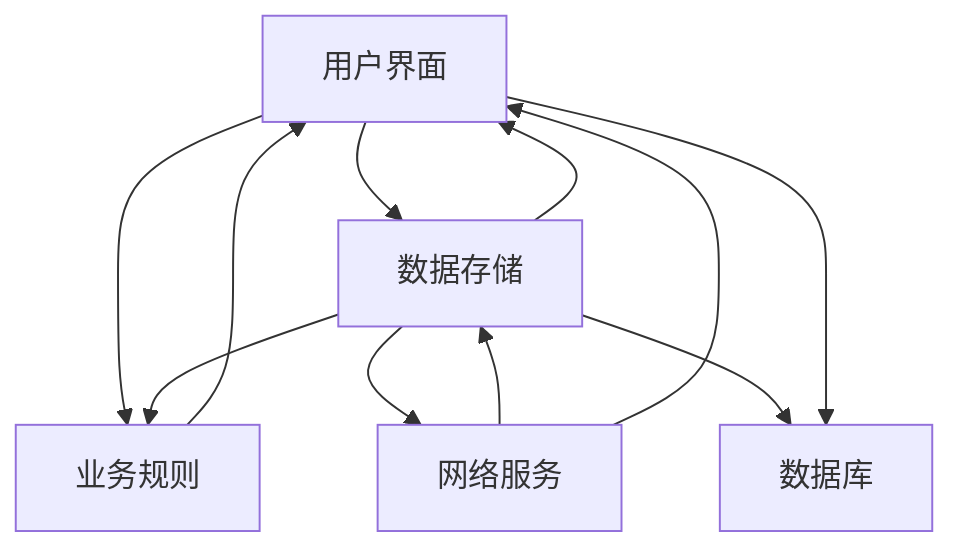
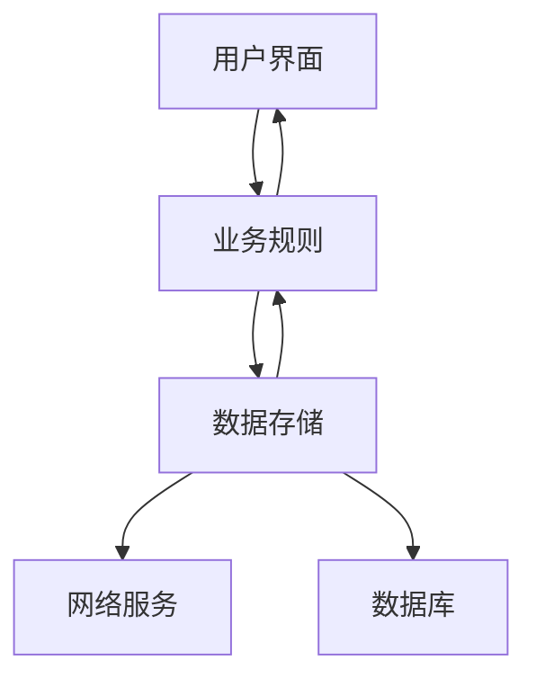

## 前言

程序员（软件工程师）的日常工作要么在开发软件要么在维护软件（废话），开发和维护软件本应该是技术和知识密集型工作，然而却干成了劳动密集型工作，这其中原因还是由于：在开发和维护软件的时候，都是在别人（架构师）制定的规范和约束下进行，即使有想法也跳不出给定的范围。这就导致技术工人变成了流水线工人，当然这也与公司组织结构也有关系。那如何打破这种局面？最好是让自己成为制定规范和约束的那个人。

制定规范和约束，是软件架构师干的工作，那自己就得了解和学会软件架构设计，而不是别人设计好，自己被投喂。被投喂的越多，丧失的主动权就越多，就越来越被动，最后进入尴尬的境地。

下面简单谈一下软件架构设计和软件设计理念。

在开始之前，可以预先思考几个问题：

1. 软件架构设计是什么？
2. 为什么要有软件架构设计？
3. 软件架构设计给软件开发和维护能带来什么好处和优势？

## 软件架构设计

软件架构其实就是一种约束和规范，达到程序的组织和管理。

比如：一个电商平台有用户管理，浏览和搜索商品，购物车，订单管理，支付，评论等，那么软件架构就是要定义这些功能组件，以及它们之间的关系和交互，并为这个平台系统提供一种框架，使开发和维护变得容易和高效。

那么软件架构应该如何设计？如何考虑？

> **架构指的是适用于整个系统范围的设计约束**
> 
> **架构的重要组成部分包含：**
> 
> * 程序组织：定义好模块（构造块，可以是单个类，也可以是许多类组成的一个子系统）
> * 主要的类：定义类的责任，如何与其他类交互，类的继承、包含关系，对象持久化等
> * 数据设计：定义所用到的数据模型，存储方式：文件，数据库等
> * 业务规则：描述依赖的特定业务规则
> * 用户界面设计：明确UI/UE
> * 资源管理：线程、内存、文件等管理
> * 安全性：保护用户秘密数据，使用数据加密，权限设置等提高安全性
> * 性能：制定性能目标，帧率、Crash率、ANR率、OOM率，耗时等
> * 可伸缩性：是否满足未来的需求
> * 互用性：与其他程序共享数据或资源。如一个公司多app，共享登录
> * 国际化/本地化：支持多语言，支持网络，支持设备硬件条件等
> * 输入输出：模块、接口、方法输入输出
> * 错误处理：检测错误，从错误中恢复，如何传播错误，错误处理约定，错误处理机制等
> * 容错性：从错误中恢复或不能恢复
> * 架构的可行性：在当前环境（项目环境，用户环境，有限资源等）下如何实施。在任何方面都是可行
> * 过度工程：按需设计，不过度设计
> * 关于“买”还是“造”的决策：使用现成的还是自己创造
> * 关于复用的决策：说明符合复用的目标
> * 变更策略：说明可预见的变更，以及这些变更的应对策略

从这些方面出发去做架构设计，制定出规范和约束，那么就可以正确的处理需求和轻松的编写代码。

但无论如何设计，目的都是为了使用计算机解决现实世界的问题，所以设计应该向计算机的“思维和逻辑”靠拢。

> 编程的核心在于将人类的思维和逻辑通过计算机语言转化为计算机能够理解和执行的指令，从而自动化地处理问题或完成任务。

架构设计完之后，该如何评估架构质量？是否能满足需求？

> **架构核对表**
> 
> **针对各架构主题**
> 
> * [ ] 程序的整体组织结构是否清晰？是否包含一个良好的架构全局观（及其理由）？
> * [ ] 是否明确定义了主要的构造块/模块（包括每个构造块的职责范围及与其他构造块的接口）？
> * [ ] 是否明显涵盖了“需求”中列出的所有功能（每个功能对应的构造块不太多也不太少）？
> * [ ] 是否描述并论证了那些最关键的类？
> * [ ] 是否描述并论证了数据设计？
> * [ ] 是否详细定义了数据库的组织结构和内容？
> * [ ] 是否指出了所有关键的业务规则，并描述其对系统的影响？
> * [ ] 是否描述了用户界面设计的策略？
> * [ ] 是否将用户界面模块化，使界面的变更不会影响程序其余部分？
> * [ ] 是否描述并论证了处理I/O的策略？
> * [ ] 是否估算了稀缺资源（如线程、数据库连接、句柄、网络带宽等）的使用量，是否描述并论证了资源管理的策略？
> * [ ] 是否描述了架构的安全需求？
> * [ ] 架构是否为每个类、每个子系统、或每个功能域(functionalit area)提出空间与时间预算？
> * [ ] 架构是否描述了如何达到可伸缩性？
> * [ ] 架构是否关注互操作性？
> * [ ] 是否描述了国际化/本地化的策略？
> * [ ] 是否提供了一套内聚的错误处理策略？
> * [ ] 是否规定了容错的办法（如果需要）？
> * [ ] 是否证实了系统各个部分的技术可行性？
> * [ ] 是否详细描述了过度工程(overengineering)的方法？
> * [ ] 是否包含了必要的“买 vs. 造“的决策？
> * [ ] 架构是否描述了如何加工被复用的代码，使之符合其他架构目标？
> * [ ] 是否将架构设计得能够适应很可能出现的变更？
> 
> **架构的总体质量**
> 
> * [ ] 架构是否解决了全部需求？
> * [ ] 有没有哪个部分是“过度架构/overarchitected“或”欠架构/underarchiected“？
> * [ ] 整个架构是否在概念上协调一致？
> * [ ] 顶层设计是否独立于用作实现它的机器和语言？
> * [ ] 是否说明了所有主要的决策动机？
> * [ ] 你，作为一名实现该系统的程序员，是否对这个架构感觉良好？

架构质量由实现该架构的人评估，所以架构设计面向的不是自己，而是别人，通过别人的检验，才能说明该架构是否可食用。

架构最终的实体都是代码，那么怎么从代码层面去判断架构质量？可以使用[类依赖可视化图](https://github.com/alexzaitsev/apk-dependency-graph)来判断：

<table>
    <tr><td><b>这是具有低耦合的良好架构式例：</b></td></tr>
    <tr><td></td></tr>
    <tr><td><b>这个看起来像意大利面条：</b></td></tr>
    <tr><td></td></tr>
</table>

- [ ] **你的项目看起来像第一张图还是第二张图？**

备注：图片来自：[good](https://github.com/alexzaitsev/apk-dependency-graph/blob/master/image-good-example.jpg)，[bad](https://github.com/alexzaitsev/apk-dependency-graph/blob/master/image-bad-example.jpg)。

## 软件设计理念

假设计算机能轻松完美的解决现实世界中的任何问题，开发的软件能在计算机中畅通无阻运行，没有存储空间，网络带宽，平台兼容，运行缓慢，错误等问题，那么软件设计将是自由的，不受限制的。

现实却不是和假设一样，软件设计受到诸多限制和不确定，所以需要去构思、创造或发明一套设计方案：利用有限的资源（计算机硬件、软件、开发语言等资源），对程序进行良好的组织和管理，然后解决现实世界中的问题。

在开发软件时，是将人的思维和逻辑转换为计算机的思维和逻辑，但人的大脑容量有限，不可能容下一整个软件。比如要开发和维护电商平台系统，那么整个系统需要拆分为多个子系统：用户管理，订单管理，支付管理系统等，这样才能方便人的大脑去理解，也就是把复杂变简单，把简单再变简单，直到理解起来毫不费劲，类似读懂1+1=2。

> 软件的首要技术使命：管理复杂度

复杂的软件是难以开发和维护的，或者说出错率特别高。当一处简单的代码改动，都不知道会对软件产生什么样的影响时，这样的软件就是烫手山芋，谁也不愿意接手。

软件的各个部分像线团一样缠绕在一起，剪不断理还乱。这样的软件很快就会停止进展，或者到达瓶颈。

所以需要降低软件复杂度，那怎么可以降低复杂度，让开发和维护变得容易和高效？

> 理想的软件特征
> 
> * 最小复杂度：简单易于理解的设计
> * 易于维护：维护的人轻易理解设计
> * 松散耦合：程序的各个组成部分之间关联最小。通过应用类接口中的合理抽象、封装性及信息隐藏等原则，设计出相互关联的尽可能最少的类
> * 可扩展性：增强系统的功能而无须破坏其底层结构。可以改动系统的某一部分而不会影响其它部分
> * 高扇入：让大量的类使用某个特定类。设计出的系统很好地利用了在低层次上的工具类（utility classes）
> * 低扇入：让一个类里少量或适中地使用其它的类
> * 可移植性：很方便地移植到其他环境中
> * 精简性：设计出的系统没有多余的部分（直到没有多余的内容需要删去）
> * 层次性：尽量保持系统各个分解层的层次性，能在任意的层面上观察系统，并得到某种具有一致性的看法。设计出来的系统应该在任意层次上观察而不需要进入其它层次
> * 标准技术：尽量使用标准化的、常用的方法，给人一种熟悉的感觉（少用稀奇古怪的技术）

从这些特征出发去做软件设计，以把复杂变简单的思想：

> 软件系统 → 分解为子系统和包 → 分解为包中的类 → 分解为类中的数据和子程序 → 子程序内部。

但在整个软件设计过程中，是从复杂走向简单，从整体走向局部，然后又从简单走向复杂，从局部走向整体，所以软件设计思维应该是在由体到面 → 由面到线 → 由线到点 与 由点到线 → 由线到面 → 由面到体之间交替进行：

* **由体到面**：
  
  * 从整体系统出发，定义系统整体架构和划分主要模块。
  
  * **比如**：在设计一个电商平台系统时，识别出用户管理，订单管理，支付管理等模块。

* **由面到线**：
  
  * 细化每个模块，确定模块之间的关系和交互，确定模块内部的功能组件划分和接口设计。
  
  * **比如**：在订单管理模块中，划分出订单创建、订单支付、订单查询等功能组件。

* **由线到点**：
  
  * 进一步细化功能组件，设计具体的类、方法和数据结构，
  * **比如**：为订单创建功能设计具体的类和方法，如 OrderService.createOrder()。

***

* **由点到线**：
  
  * 实现具体的类和方法，并将它们组合成完整的功能组件。
  * **比如**：实现 OrderService.createOrder() 方法，并编写单元测试。

* **由线到面**：
  
  * 将功能组件集成到模块中，并进行集成测试。
  * **比如**：将订单创建、订单支付等功能组件集成到订单管理模块中，并进行集成测试。

* **由面到体**：
  
  * 将所有模块集成成一个完整的系统，并进行系统测试和优化。
  * **比如**：将用户管理，订单管理，支付管理等模块集成到电商平台系统中，并进行系统测试和性能优化。

这样交替思维方式才能更好的理解和把握软件的整体和细节，才能更高地管理软件复杂度。

## 总结

不论软件架构如何设计，它的宗旨是方便软件的开发和维护，所以软件架构设计不能脱离实际，做设计的同时也要去做开发和维护，这样才能不断迭代或反哺设计，从而让设计为开发和维护更高效的服务。

要从软件开发和维护的角色，转换成软件设计的角色，需要从日常软件迭代中不断地去思考和实践。软件设计是思想，不同软件有不同设计，同一软件在不同的环境和资源中也有不同设计，所以不可能一劳永逸，但设计多了总会找到方法论。

软件设计方法论可以从三个方面去提取：

1. 软件架构其实就是一种约束和规范，达到程序的组织和管理。
2. 软件的首要技术使命：管理复杂度。
3. 在整个软件设计过程中，是从复杂走向简单，从整体走向局部，然后又从简单走向复杂，从局部走向整体，所以软件设计思维应该是在由体到面 → 由面到线 → 由线到点 与 由点到线 → 由线到面 → 由面到体之间交替进行。

***

参考文档

1. 代码大全2
