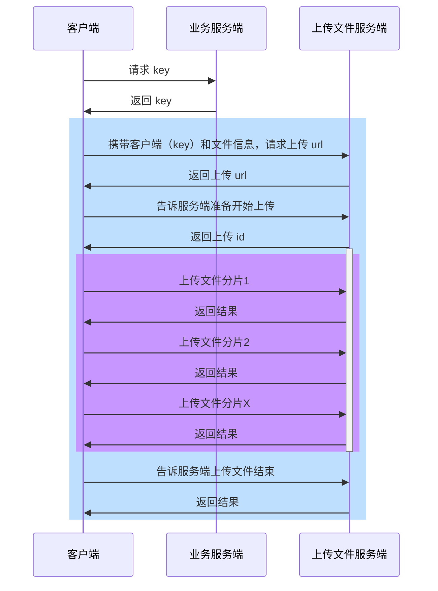
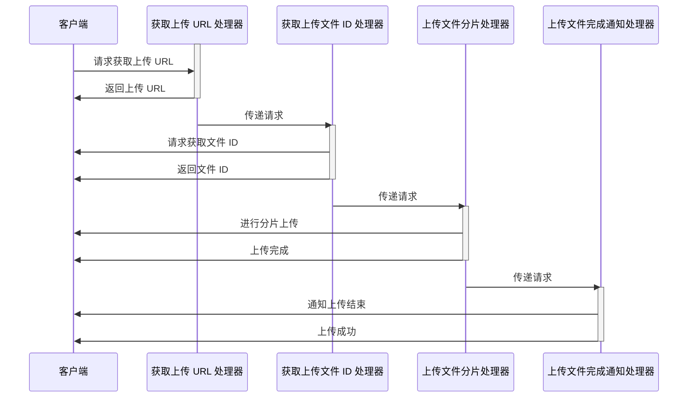

## 简介

情境：技术需求，支持鸿蒙平台上传文件，同时通过 KMP 支持 Android, iOS, Harmony 平台上传文件逻辑共用。

任务：负责鸿蒙平台上传文件，以及将上传文件共用逻辑下沉到 KMP，支持 Android, iOS, Harmony平台。

行动：熟悉鸿蒙和 KMP 开发，制定 KMP 上传文件技术方案，主导并实施。

结果：鸿蒙平台支持文件上传，多方业务可以直接使用，并制定出 KMP 上传文件逻辑共用雏形。

KMP 开发上传文件组件的**重点**：**依赖倒置原则和责任链设计模式**。

## 技术方案

### 基础信息

本次开发受到两大限制：
1. Android 和 iOS 平台已经有自己独立的上传文件库，这次只是在 Harmony 平台新增上传文件库，所以并不能把所有上传文件逻辑都下沉到 KMP。
2. 上传文件涉及访问网络，存储数据，而网络库和数据库在 KMP 中，要同时支持 Android, iOS, Harmony 技术上不可行（因为项目目前不支持 Kotlin/Native）。

由于这两大限制，所以目前在 KMP 能做的主要是：
1. 上传文件流程逻辑共用，也就是 KMP 有上传文件的整体结构，然后定义出整体中的部分接口，由 Andriod, iOS, Harmony 平台各自实现。
2. 数据模型和普通类等可共用。

上传文件客户端和服务端交互时序图：

抛开第一次业务关联请求，通用上传文件包含四步：
1. step1：获取上传文件 url
2. stpe2：获取上传文件 id
3. step3：上传文件分片
4. step4：上传文件结束

业务使用方诉求，提供上传操作：
1. 创建上传：`create`
2. 开始上传：`start`
3. 暂停上传：`pause`
4. 重新上传：`resume`
5. 取消上传：`cancel`

业务使用方诉求，提供上传步骤监听：
1. 上传开始：`onStart`
2. 上传进度：`onProgress( progress )`
3. 上传速度：`onSpeed( speed, remainTime)`
4. 上传成功：`onSuccess`
5. 上传失败：`onFail`
6. 上传暂停：`onPause`
7. 上传重新开始：`onResume`

业务使用方诉求，提供上传网络监听：
1. 没有网络：`onNoNet`
2. 当前网络：`onWifi`

### 上传文件设计

上传文件设计的核心主要是：
1. **责任链设计模式**：上传文件分为四个步骤，每个步骤独立，一个步骤完成后交给下一个步骤。
2. **依赖倒置原则**：上传文件中的上传步骤需要访问网络和存储数据，这在KMP中不能直接实现，所以定义抽象接口，让各平台实现抽象接口。

上传文件步骤时序图：

上传文件设计：

```mermaid
graph BT
 subgraph Upload File[上传文件]
 
 subgraph Platform[平台业务]
  direction TB
  
  subgraph Android
  end
  subgraph iOS
  end
  subgraph Harmony
  end
  
  subgraph UploadEntity[上传实体]
  direction LR
    
    subgraph UploadEnter[上传]
    direction LR
    UploadStep["上传操作：创建，开始，暂停，重新开始，取消"] ---
    UploadStepListener[注册/取消注册上传步骤监听] ---
    UploadNetworkListener[注册/取消注册网络监听]
    style UploadStep fill:#FAD7A0,stroke:#D35400,stroke-width:1.5px
    style UploadStepListener fill:#FAD7A0,stroke:#D35400,stroke-width:1.5px
    style UploadNetworkListener fill:#FAD7A0,stroke:#D35400,stroke-width:1.5px
    end
    
    subgraph UploadDelegate["平台实现 Delegate"]
    direction LR
       subgraph UploadStepDelegate["Upload Step Delegate Implementation"]
       direction LR
       FetchUploadUrlHandlerDelegate1[FetchUploadUrlHandlerDelegateImpl]
       FetchFileIdHandlerDelegate1[FetchFileIdHandlerDelegateImpl]
        UploadChunksHandlerDelegate1[UploadChunksHandlerDelegateImpl]
        CompleteUploadHandlerDelegate1[CompleteUploadHandlerDelegateImpl]
       end
       subgraph StorageDelegate[Storage Delegate Implementation]
        DatabaseDelegate1[DatabaseDelegateImpl]
       end
       UploadStepDelegate ---- StorageDelegate
    end
  
  end
     Android ---->UploadEntity
    iOS---->UploadEntity
    Harmony---->UploadEntity
 end
 
 subgraph KMP
 direction TB
 subgraph UploadTask[上传中心]
   direction LR
   create[创建上传] --- start[开始上传] --- pause[暂停上传] --- resume[重新上传] --- cancel[取消上传]
   style create fill:#AED6F1,stroke:#2E86C1,stroke-width:1.5px
   style start fill:#AED6F1,stroke:#2E86C1,stroke-width:1.5px
   style pause fill:#AED6F1,stroke:#2E86C1,stroke-width:1.5px
   style resume fill:#AED6F1,stroke:#2E86C1,stroke-width:1.5px
   style cancel fill:#AED6F1,stroke:#2E86C1,stroke-width:1.5px
 end
 
 subgraph UploadHandlers[责任链处理器]
    direction TB
    subgraph FetchUpload[获取上传URL]
    direction TB
    FetchUploadUrlHandler --> FetchUploadUrlHandlerDelegate
    end
    subgraph FetchFile[获取上传文件ID]
    direction TB
    FetchFileIdHandler --> FetchFileIdHandlerDelegate
    end
    subgraph UploadChunks["上传文件分片"]
    direction TB
    UploadChunksHandler --> UploadChunksHandlerDelegate
       subgraph UploadChunksOpetation["特殊操作"]
       direction TB
       UploadChunksRetry[Retry] ---
       UploadChunksDelete[Delete]
       end
    end
    subgraph CompleteUpload[上传文件结束]
    direction TB
    CompleteUploadHandler --> CompleteUploadHandlerDelegate
    end
    FetchUpload --传递请求--> FetchFile
    FetchFile --传递请求--> UploadChunks
    UploadChunks --传递请求--> CompleteUpload
    
    style FetchUpload fill:#D5F5E3,stroke:#239B56,stroke-width:1.5px
    style FetchFile fill:#D5F5E3,stroke:#239B56,stroke-width:1.5px
    style UploadChunks fill:#D5F5E3,stroke:#239B56,stroke-width:1.5px
    style CompleteUpload fill:#D5F5E3,stroke:#239B56,stroke-width:1.5px
    style UploadChunksOpetation fill:#D5F5E3,stroke:#239B56,stroke-width:1.5px
 end
 
 subgraph StorageService["存储服务"]
 direction TB
 Database --> DatabaseDelegate
 style StorageService fill:#FADBD8,stroke:#922B21,stroke-width:1.5px
 end
 
 subgraph EventService["事件服务"]
 direction TB
 startEvent --- progressEvent --- speedEvent --- successEvent --- failEvent --- pauseEvent --- resumeEvent
 style EventService fill:#D7BDE2,stroke:#7D3C98,stroke-width:1.5px
 end
 
 UploadTask --触发----> UploadHandlers
 UploadTask <--注册事件监听/通知事件--> EventService
 UploadHandlers --通知上传步骤状态--> EventService
 UploadHandlers <--写入/读取上传步骤数据--> StorageService
 
 end
 Platform --使用/注册----> KMP
 end

```

### 上传分片要点

上传分片请求方式采用 `PUT` 请求：

| | PUT | POST |
| --- | --- | --- |
| 用途 | 更新 / 替换文件（如果文件已经存在，则覆盖该文件；如果文件不存在，则创建新文件） |创建新文件 |
| 幂等性 | 幂等（多次请求结果相同） | 非幂等（多次请求可能创建多个文件） |
| 文件路径 | 客户端提供文件名和 URL，服务器不会自动生成文件名  | 服务器生成文件名和存储路径 |
| 断点续传 | 适合  | 不适合  |
| 适用场景 | 云存储、对象存储、CDN  | 用户上传（表单、社交平台）  |

PUT 请求能更好的满足需求。

当执行取消上传文件时，使用 `DELETE` 请求删除已上传的文件分片。

上传分片请求头：`"Content-Type": "application/octet-stream",`，表示通用二进制数据流的 MIME 类型。

### 访问网络和存储数据

在鸿蒙平台中，访问网络和存储数据主要使用：
- 网络库：使用 [axios](https://www.npmjs.com/package/axios#features) 做网络请求。
- 数据库：使用鸿蒙原生关系型数据库[#relationalStore](https://developer.huawei.com/consumer/cn/doc/harmonyos-references/js-apis-data-relationalstore#relationalstoregetrdbstore)，基于SQLite。

## 统计数据

上传文件的需要统计的数据有：
1. 上传文件漏斗，从 获取上传文件 url &rarr; 获取上传文件 id &rarr; 上传文件分片 &rarr;上传文件结束
1. 上传文件每个步骤成功率，以及整个流程成功率
2. 上传文件每个步骤耗时
3. 上传文件分片速度（MB/S）
4. 上传文件失败的错误原因

### 上传文件漏斗

上传文件漏斗，如：

| 步骤 | 开始 | 获取上传文件 url | 获取上传文件 id | 上传文件分片 |上传文件结束 |到达率 |
| ---| --- | --- |--- |--- |--- |--- |
| 次数 | 2922990|2911363|2907119|2708832 |2707391 |92.28%|

### 上传文件成功率

上传成功率健康水位（业务自我制定），比如视频文件上传成功率：

| 日期 | 获取上传文件 url | 获取上传文件 id | 上传文件分片 |上传文件结束 |成功率 |
| --- | --- |--- |--- |--- |--- |
| 20240901 | 99.19% |99.83% |92.85% |99.87% |91.81% |
| 20240902 | 99.19% |99.82% |92.41% |99.82% |91.33% |

### 上传文件耗时

上传文件耗时（9分位），如：

| 日期 | 获取上传文件 url | 获取上传文件 id | 上传文件分片 |上传文件结束 |
| --- | --- |--- |--- |--- |
| 20240901 | 410ms |214ms |591ms |158,286ms |
| 20240902 | 405ms |214ms|625ms |174.207ms |

### 上传文件分片速度

上传文件分片速度（M/S），如：

| 日期 | 5分位 |6分位|
| --- | --- |--- |
| 20240901 | 3.83 |6.78|
| 20240902 | 3.99 |6.68|

### 上传文件失败的错误原因

上传文件失败的错误原因，如：

| #| error_msg | count |
| --- | --- |--- |
| 1 | 预检查错误，没有网络 |4|
| 2 | 预检查错误，文件大小为0 | 7|
| 3 | 过程错误，服务器异常 | 3|
| 4 | 预检查错误，文件不存在 | 2|
| 5 | 其它 | x|

### 95分位

统计95分位，主要是关注大多数用户的体验，而不被极端情况（上传文件异常慢）影响。

95分位耗时时间（95%的用户上传耗时时间小于等于 X）：

假设 10 个用户上传文件耗时时间为（单位秒）[10,9,8,7,6,5,4,3,2,1]，排序后为[1,2,3,4,5,6,7,8,9,10]。

 **计算 P95（95 分位）**

10×0.95=9.5

-   **索引为 9.5**，即**第 9 和第 10 个数之间**。
-   **插值计算**： P95=9+0.5×(10−9)=9+0.5=9.5。

**P95 = 9.5**

## 难点

跨平台开发，调试困难，在 KMP 环境中写共用逻辑，在 Android, iOS, Harmony 环境中验证，这需要对这个文件上传诉求有充分理解，且设计要足够详细。

唯一有助于调试的就是打印日志。

## 改进

由于项目有访问网络库和数据库的限制，KMP 上传文件组件的核心只能通过定义接口，然后让Harmony, Android, iOS平台去实现。

但现在 KMP 有支持 Android, iOS, Native 的 网络库 [Ktor](https://ktor.io/) 和数据库 [sqldelight](https://sqldelight.github.io/sqldelight/2.1.0/)。所以项目只要支持 Kotlin/Natvie，那么就可以在 KMP 中完整实现上传组件库。然后直接给鸿蒙使用，并逐渐替换在 Android 和 iOS中的上传组件。

## 总结

上传文件需求是一个全技术需求，并作为 Android, iOS, Harmony 应用基础库，首先要做的就是分析出通用业务诉求，这样才能制定合理的技术设计，以满足所有业务场景。技术是为业务服务的。

由于部分历史原因，以及跨平台技术限制，设计文件上传共用架构时采用依赖倒置原则，以达到各平台兼容。

文件上传分为多个步骤，一个步骤执行完成之后执行下一个步骤，这可以充分利用责任链设计模式来实现。

最后，统计数据最为重要，这关系着文件上传文件库的质量，开发完线上运行结果是好是坏就看这个性能指标数据了。

