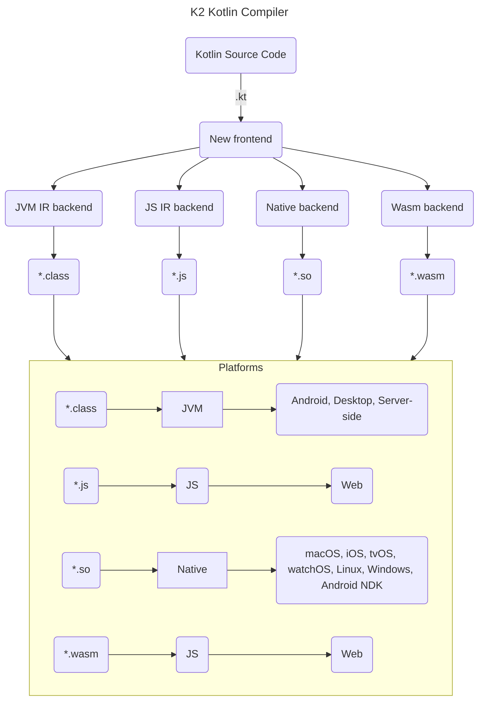

## 引言
在 KMP 中做逻辑共享，如果逻辑不依赖平台特性，那么就把所有逻辑都写在 `commonMain` 中，所有平台（`androidMain`，`iosMain`，`jsMain`，`jvmMain`等）直接共享；如果逻辑依赖平台特性，那么就需要通过 `expect` 和 `actual` 机制来访问平台特性，然后把部分逻辑写在各自平台（`androidMain`，`iOSMain`，`jsMain`，`jvmMain`等）中，以此实现平台共享。

当然，也可以将依赖平台特性相关逻辑封装成通用库（比如：[kotlinx-datetime](https://github.com/Kotlin/kotlinx-datetime/tree/master)），让所有逻辑都在`commonMain` 中（看似）。

## expect 和 actual 声明

### 定义

`expect` 和 `actual` 声明定义了一套规则：
- `expect`：表示预期声明，只能用在 `commonMain`代码中，用于描述跨平台代码的功能，不提供具体实现。
- `actual`：表示实际声明，用在`androidMain`，`iosMain`，`jsMain`，`jvmMain`等平台代码中，与 `expect` 声明一一对应，提供具体实现。

这感觉 `expect` 像是声明接口，而 `actual` 是像是声明接口实现，在 `commonMain` 中不关心平台具体实现，到了每个平台才实现并处理相关逻辑。

### 文件名命名规则

首先，`actual`和`expect`声明相关`.kt`文件需要有相同命名空间。其次，特定平台需要关联其平台后缀。

如果在 `commonMain` 使用 `expect`声明相关`.kt`文件为：`commonMain/kotlin/Platform.kt`，那么特定平台使用 `actual` 声明相关`.kt` 文件为：
- Android 平台：`androidMain/kotlin/Platform.android.kt`
- iOS 平台：`iosMain/kotlin/Platform.ios.kt`
- Desktop 平台：`jvmMain/kotlin/Platform.jvm.kt`
- Web 平台（js）：`jsMain/kotlin/Platform.js.kt`
- Web 平台（wasm）：`wasmMain/kotlin/Platform.wasm.kt`

当编译代码生成各个平台产物时，Kotlin 编译器会合并彼此对应的`expect`声明和`actual`声明，让 `commonMain` 中使用 `expect` 声明的地方都使用各个平台的 `actual` 声明。


### 使用

在 `commonMain`中使用`expect`可以声明函数、属性、类、接口、枚举或注解：

```kotlin
//在 commonMain 中

//函数：获取当前时间字符串
expect fun getCurrentTime(pattern: String): String

//属性：获取平台名称
expect val platformName: String

//类：打印日志
expect class Logger {
    fun log(tag: String, message: String)
}

//接口：获取设备信息
expect interface DeviceInfo {
    val osName: String
    val deviceModel: String
}

//枚举：屏幕方向枚举
expect enum class ScreenOrientation {
    PORTRAIT, LANDSCAPE
}

//注解
@OptIn(ExperimentalMultiplatform::class)
@Target(AnnotationTarget.CLASS)
@Retention(AnnotationRetention.RUNTIME)
@OptionalExpectation
expect annotation class Serializable()
```

在 `expect` 声明类、接口、枚举和注解时，会遇到 warning：

```js
'expect'/'actual' classes (including interfaces, objects, annotations, enums, and 'actual' typealiases) are in Beta. You can use -Xexpect-actual-classes flag to suppress this warning. Also see: https://youtrack.jetbrains.com/issue/KT-61573
```
可以在 build.gradle.kt 添加配置：

```kotlin
kotlin{

targets.configureEach {
    compilations.configureEach {
        compileTaskProvider.get().compilerOptions {
            freeCompilerArgs.add("-Xexpect-actual-classes")
        }
    }
}

}
```


那么，在`androidMain`，`iOSMain`，`jsMain`，`jvmMain`等平台中使用 `actual` 声明为：
```
//函数：获取当前时间字符串
actual fun getCurrentTime(pattern: String): String {
    return "TODO"
}

//属性：获取平台名称
actual val platformName: String = "TODO"

//类：打印日志
actual class Logger {
    actual fun log(tag: String, message: String) {
        //TODO
    }
}

//接口：获取设备信息
actual interface DeviceInfo {
    actual val osName: String
    actual val deviceModel: String
}

//枚举：屏幕方向枚举
actual enum class ScreenOrientation {
    PORTRAIT, LANDSCAPE
}

//注解
@Target(AnnotationTarget.CLASS)
@Retention(AnnotationRetention.RUNTIME)
actual annotation class Serializable()
```
假设现在需要在 UI 上显示当前时间，时间格式为 `yyyy-MM-dd HH:mm:ss`。那么，在
`commonMain/kotlin/Platform.kt` 中：

```kotlin
//函数：获取当前时间字符串
expect fun getCurrentTime(pattern: String): String
```
在 Android 平台中，`androidMain/kotlin/Platform.android.kt`：

```kotlin
import android.text.format.DateFormat
import java.util.Date

actual fun getCurrentTime(pattern: String): String {
    return DateFormat.format(pattern, Date()).toString()
}
```
在 iOS 平台中，`iosMain/kotlin/Platform.ios.kt`：

```kotlin
import platform.Foundation.NSDate
import platform.Foundation.NSDateFormatter

actual fun getCurrentTime(pattern: String): String {
    val dateFormatter = NSDateFormatter()
    dateFormatter.setDateFormat(pattern)
    return dateFormatter.stringFromDate(NSDate())
}
```
在 Desktop 平台中，`jvmMain/kotlin/Platform.jvm.kt`：
```kotlin
import java.time.LocalDateTime
import java.time.format.DateTimeFormatter

actual fun getCurrentTime(pattern: String): String {
    return LocalDateTime.now().format(DateTimeFormatter.ofPattern(pattern))
}
```

在 Web 平台中（js）：`jsMain/kotlin/Platform.js.kt`

```kotlin
actual fun getCurrentTime(pattern: String): String {
    return kotlin.js.Date().toLocaleString()
}
```

### 编译产物

这里以上面的代码，以及 Android 平台为例子。

假设在 kmp 项目中的逻辑模块为：`:shared`，那么在命令行执行`./gradlew :shared:assembleDebug`后，shared 目录下会生成：`/build/outputs/aar/shared-debug.aar`产物，使用 AndroidStuido 打开 shared-debug.aar，里面 classes.jar 下相关 class 文件为：

```
classes.jar
  -- ScreenOrientation.class
  -- Platform_androidKt.class
  -- Logger.class
  -- Serializable.class
  -- DeviceInfo.class
```
ScreenOrientation.class：

```kotlin
public final enum class ScreenOrientation private constructor() : kotlin.Enum<ScreenOrientation> {
    PORTRAIT,

    LANDSCAPE;
}
```
Platform_androidKt.class：
```kotlin
public val platformName: kotlin.String /* compiled code */

public fun getCurrentTime(pattern: kotlin.String): kotlin.String { /* compiled code */ }
```
Logger.class：
```kotlin
public final class Logger public constructor() {
    public final fun log(tag: kotlin.String, message: kotlin.String): kotlin.Unit { /* compiled code */ }
}
```
Serializable.class：
```kotlin
@kotlin.annotation.Target @kotlin.annotation.Retention public final annotation class Serializable public constructor() : kotlin.Annotation {
}
```
DeviceInfo.class：
```kotlin
public interface DeviceInfo {
    public abstract val osName: kotlin.String

    public abstract val deviceModel: kotlin.String
}
```
所以，编译得到的 Android 平台产物，会把在 `commonMain/kotlin/Platform.kt` 中使用 `expect` 声明的地方都使用`androidMain/kotlin/Platform.android.kt`中的 `actual` 声明。

### 互操作性

通过 `expect` 和 `actual` 声明机制可以访问不同平台的原生 API。但这种机制的具体实现依赖于Kotlin 语言与其它语言的互操作性。


| 平台（部署） | 语言 | 互操作性 |
| --- | --- | --- |
|  Android |  Kotlin &lrarr; Java| <blockquote>Kotlin 在设计时就考虑了 Java 互操作性。可以从 Kotlin 中自然地调用现存的 Java 代码，并且在 Java 代码中也可以很顺利地调用 Kotlin 代码。</blockquote>|
|  iOS | Kotlin &lrarr; C/C++ </br>Kotlin &lrarr; Swift/Objective-C | <blockquote>POSIX、 gzip、 OpenGL、 Metal、 Foundation 以及许多其他流行库与 Apple 框架都已预先导入并作为 Kotlin/Native 库包含在编译器包中。</blockquote>|
|  Desktop(JVM) | Kotlin &lrarr; Java | |
|  Server-side(JVM) | Kotlin &lrarr; Java | |
| Web based on Kotlin/Wasm|  Kotlin &lrarr; JS </br> Kotlin &lrarr; C/C++| |
| Web based on Kotlin/JS| Kotlin &lrarr; JS | <blockquote>Kotlin/JS 提供了转换 Kotlin 代码、Kotlin 标准库的能力，并且兼容 JavaScript 的任何依赖项。Kotlin/JS 的当前实现以 [ES5](https://www.ecma-international.org/ecma-262/5.1/) 为目标。</blockquote> |

Kotlin 语言与 Java 语言具有无缝互操作性，与 C/C++ 和 Swift/Objective-C 语言具有一定程度上的互操作性，与 JavaScript 语言具有很大程度上的互操作性。


### 编译目标

在`commonMain`和`androidMain` 或 `iosMain` 或 `jvmMain` 或 `jsMain` 或 `wasmMain` 平台的代码，最终都会通过编译器转换为平台可执行的文件。

KMP 的跨平台能力，是通过编译器编译目标来实现的：`Kotlin/JVM`， `Kotlin/Native`，`Kotlin/JS`。



**Kotlin Source Code**：`commonMain` 和 `androidMain` 或 `iosMain` 或 `jvmMain` 或 `jsMain` 或 `wasmMain`中的代码.

**Frontend Compiler**：负责解析 Kotlin 代码、验证语法和语义等，并生成跨平台的中间表示（IR）。

**Intermediate Representation(IR)**：将 Kotlin 代码转换为与平台无关的中间表示（IR）。

**Backend Compiler**：IR 被转换为特定平台的产物。
- **JVM IR Backend**：将 IR 转换为 JVM 字节码（`.class`文件）
- **Native Backend**：将 IR 转换为平台原生的机器码（`so` ，`.dylib`文件等）
- **JS IR Backend**：将 IR 转换为 JavaScript 文件（`.js`文件）
- **Wasm Backend**：将 IR 转换为 WebAssembly 文件（`.wasm`文件）


### 依赖倒置原则
`expect` 和 `actual` 声明机制与依赖倒置原则是完美结合的。

依赖倒置原则的核心是：
- 高层模块不应该依赖底层模块，两者都应该依赖于抽象。
- 抽象不应该依赖于具体实现，具体实现应该依赖于抽象。

高层模块不依赖于底层模块：
- 高层模块只依赖于`expect`，与底层模块具体的 `actual` 无关。

抽象不依赖具体实现：
- 高层模块的 `expect` 声明，定义抽象，依赖抽象。
- 底层模块的 `actual` 声明，实现抽象，依赖抽象。

依赖倒置原则带来的好处是：
- 解耦：各个平台各自独立实现，跨平台逻辑完全隔离。
- 灵活：不同实现或新增实现，都无需修改高层代码。

在 KMP 项目中开发，遇到跨平台问题时，可以优先考虑使用依赖倒置原则来解决。比如：网络状态监听器。

## 总结

在 KMP 项目中，想要访问平台不同特性，可以使用`expect` 和 `actual`声明，`expect` 和 `actual` 声明遵循依赖倒置原则，`expect`声明定义与平台无关的抽象，`actual`声明实现与平台相关的抽象。

使用 `expect` 声明在 `commonMain` 中定义跨平台能力，使用 `actual` 声明在`androidMain` 或 `iosMain` 或 `jvmMain` 或 `jsMain` 或 `wasmMain`中实现跨平台能力。在构建时，Kotlin 编译器会合并彼此对应的`expect`声明和`actual`声明。

在不同平台上，Kotlin 语言与 Java 或 C/C++ 或 Swift/Object-C 或 JS 语言具有一定程度的互操作性。


编译器将 Kotlin 源码，通过 frontend compiler，IR，backend compiler，最终转换为各平台可执行文件`.class`，`.so`， `.js`，`.wams`，以此达到原生性能的要求在各平台运行。

## 参考文档
1. [Expected and actual declarations](https://kotlinlang.org/docs/multiplatform-expect-actual.html)
2. [kotlin 语言指南](https://legacy.kotlincn.net/docs/reference/server-overview.html)
