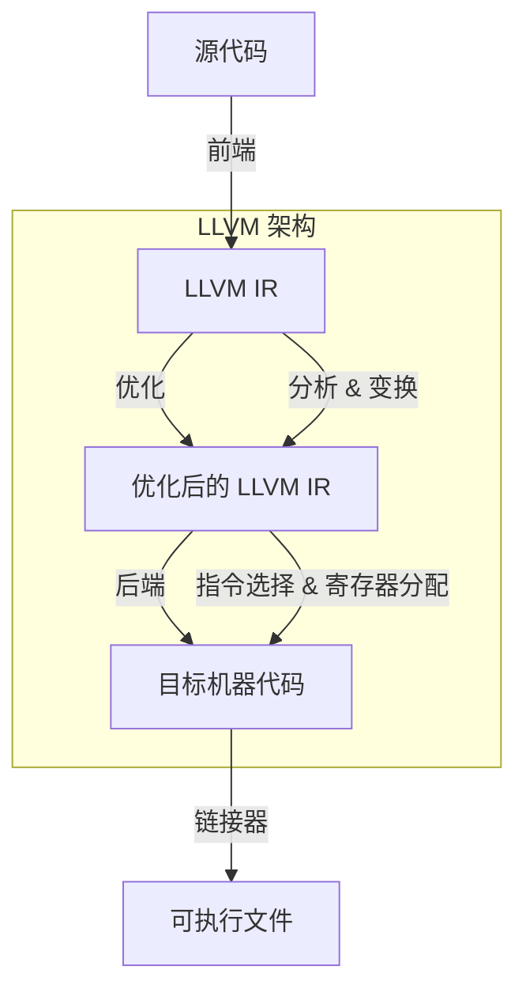
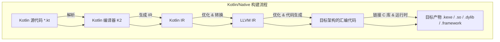
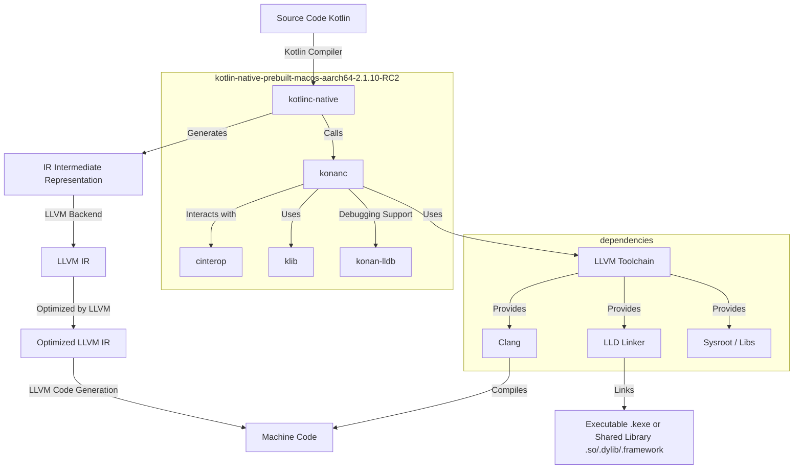

## 前言

为了让 Kotlin Multiplatform 的逻辑共享更丝滑的支持 Android, iOS, Harmony 平台，如访问数据库，网络，多线程，多媒体逻辑等，采用 Kotlin/Native 是一种不错的方式。

没有 JVM 环境，也能让 Kotlin 代码在 macOS, Linux, Windows, `Android`，`iOS`, `Harmony` 等平台上运行，这就是 Kotlin Multiplatform 中 Kotlin/Native 所做的事情。

Kotlin/Native 可以将 Kotlin 代码生成可运行的本机二进制文件：`*.so`，`*.framework`。`*.so `可以给 Android 和 Harmony使用，`*.framework` 可以给 iOS使用。

Kotlin/Native 能生成可运行的本机二进制文件，主要是依靠：一个基于[LLVM](https://llvm.org/)的 Kotlin 编译器后端和一个 Kotlin 标准库的本机实现。

### LLVM

> LLVM 项目是模块化和可重用编译器和工具链技术的集合。尽管 LLVM 的名称如此，但它与传统虚拟机几乎没有关系。名称“LLVM”本身并不是缩写；它是项目的全名。
> 
>LLVM 最初是[伊利诺伊大学](https://cs.illinois.edu/)的一个[研究项目](https://llvm.org/pubs/2004-01-30-CGO-LLVM.html)，其目标是提供一种基于 SSA 的现代编译策略，能够支持任意编程语言的静态和动态编译。从那时起，LLVM 已发展成为一个由许多子项目组成的综合项目，其中许多子项目被各种 [商业和开源](https://llvm.org/Users.html)项目用于生产，并被广泛用于[学术研究。LLVM 项目中的代码根据](https://llvm.org/pubs/)[ “Apache 2.0 许可证（LLVM 例外）”](https://llvm.org/docs/DeveloperPolicy.html#new-llvm-project-license-framework)获得许可

LLVM 主要用于程序的编译、优化和代码生成。

LLVM 的工作流程：


上面工作流程中的重要组成部分包含：

-   **源代码：** 开发者编写的各种编程语言的源代码。

-   **前端：** 不同的编程语言有不同的前端，负责将源代码转换为 LLVM IR。

-   **LLVM IR：** 一种平台无关的中间表示形式，方便后续的优化和代码生成。

-   **优化器：** 对 LLVM IR 进行各种优化，提高代码执行效率。

-   **后端：** 将优化后的 LLVM IR 转换为目标平台的机器码。

-   **机器码：** 可以在目标平台上直接运行的二进制代码。

-   **链接器：** 将生成的目标代码与库文件链接，形成最终的可执行文件或库。

在 Kotlin/Native 中，通过 LLVM 实现 Kotlin 代码到本机二进制的转换。

## C/C++ 项目构建工具和构建流程
Kotlin/Native 主要是与C/C++交互，产物也是对接 Native 项目，所以先了解一下 C/C++项目构建工具和构建流程。

C/C++ 项目构建工具有：Make, CMake, Bazel, Ninja, Meson, Autotools。在 Android Native 和 Harmony Native 项目中，都使用 CMake 构建工具。

**CMake** 适合跨平台中大型项目，通过 `CMakeLists.txt` 配置构建项目：

```
# 指定最低 CMake 版本
cmake_minimum_required(VERSION 3.10)

# 定义项目名称
project(MyProject)

# 设置 C++ 标准版本
set(CMAKE_CXX_STANDARD 17)
# 强制使用指定 C++ 版本
set(CMAKE_CXX_STANDARD_REQUIRED ON)

# 添加子目录
add_subdirectory(external/SomeLibrary)

# 头文件和源文件
include_directories(${PROJECT_SOURCE_DIR}/include)
aux_source_directory(src SRC_LIST)

# 目标
add_executable(my_program ${SRC_LIST})
target_link_libraries(my_program SomeLibrary)

# 编译选项
target_compile_options(my_program PRIVATE -Wall -Wextra -O2)

# 产物输出
set(CMAKE_RUNTIME_OUTPUT_DIRECTORY ${CMAKE_BINARY_DIR}/bin)
set(CMAKE_LIBRARY_OUTPUT_DIRECTORY ${CMAKE_BINARY_DIR}/lib)

# 平台相关
if(WIN32)
    message(STATUS "Building for Windows")
    add_definitions(-DPLATFORM_WINDOWS)
elseif(APPLE)
    message(STATUS "Building for macOS")
elseif(UNIX)
    message(STATUS "Building for Linux")
endif()
```

C/C++ 项目构建流程主要包含：预处理、编译、汇编、链接。


| 阶段 | 主要作用 | 工具 | 产物 |
| --- | --- | --- | --- |
| 预处理（Preprocessing）| 处理宏、头文件包含、条件编译指令 | 预处理器（如 `cpp`）| `.i`（预处理后的代码）|
| 编译（Compilation）| 将预处理后的代码转换为汇编代码 | 编译器（如 `gcc`、`clang`、`MSVC`） | `.s`（汇编代码） |
| 汇编（Assembly）| 将汇编代码转换为机器码（目标文件） | 汇编器（如 `as`） | `.o` 或 `.obj`（目标文件） |
| 链接（Linking)| 合并目标文件和库，生成可执行文件或共享库 | 链接器（如 `ld`、`lld`、`MSVC link.exe`）| 可执行文件（如 `app`、`app.exe`）或动态库（如 `.so`、`.dll`）|

## Kotlin/Native 项目构建工具和构建流程

Kotlin/Native 项目构建工具：Gradle。通过 build.gradle.kts 配置构建项目：

```kotlin
//构建二进制文件
kotlin {
   //生成ios平台下的 .framework
    val xcf = XCFramework()
    val iosTargets = listOf(iosX64(), iosArm64(), iosSimulatorArm64())
    iosTargets.forEach {
        it.binaries.framework {
            baseName = "shared"
            xcf.add(this)
        }
    }
    //生成android平台下的 .so
    val androidTargets = listOf(androidNativeArm64(), androidNativeX64())
    androidTargets.forEach {
        it.binaries {
            executable {

            }
            sharedLib {
                baseName = "shared"
            }
        }
    }
    //生成linux平台下的 .so
    val linuxTargets = listOf(linuxArm64(), linuxX64())
    linuxTargets.forEach {
        it.binaries {
            executable {

            }
            sharedLib {
                baseName = "shared"
            }
        }
    }
}
```
Kotlin/Native 项目构建流程主要包含：前端（frontend）编译，后端（backend）编译，链接（linking）
- 前端（frontend）编译 ：解析 Kotlin 代码，生成中间表示（IR）。
- 后端（backend）编译 ：优化 IR，并用 LLVM 生成目标平台的机器码。
- 链接（linking） ：与 C/C++ 代码、标准库和其他依赖项链接，生成最终的可执行文件或动态库。

KMP 项目使用 K2 编译器：


在 Kotlin/Native 项目中，经过前端编译后得到 Kotlin IR，Native backend 首先将 Kotlin IR 转换为 LLVM IR，LLVM IR 再通过 LLVM 后端生成目标平台机器码，机器码最后经过链接生成最终可执行文件。




在 Kotlin/Native 项目中使用 Gradle 工具构建，在 C/C++ 项目中使用 Cmake 工具构建。在 Kotlin/Native 项目中的主要构建流程是前端编译、后段编译、链接，在 C/C++项目中的主要构建流程是预处理、编译、汇编、链接。

了解 C/C++ 项目与 Kotlin/Native 项目在构建工具和构建流程上的差异，有助于解决 Kotlin/Native 产物在Andriod, iOS, Harmony, Linux, Macos, Windows等上遇到的跨平台问题，比如找不到符号，找不到依赖库，交叉编译失败等。


## Kotlin/Native 预构建工具链

当 [Kotlin/Native 项目](https://github.com/Kotlin/kmp-native-wizard)在 AS 中构建时，会下载 **Kotlin/Native 预构建工具链**和 **Kotlin/Native 项目所需依赖库**文件。它们下载位置位于：

- Kotlin/Native 预构建工具链：`~/.konan/kotlin-native-prebuilt-macos-aarch64-2.1.10-RC2`
- Kotlin/Native 项目所需依赖库：`~/.konan/dependencies`

目录结构：
```
.konan

├── dependencies

│   ├── aarch64-unknown-linux-gnu-gcc-8.3.0-glibc-2.25-kernel-4.9-2  # arm64 Linux 交叉编译工具链

│   ├── cache

│   ├── libffi-3.3-1-macos-arm64

│   ├── lldb-4-macos # LLVM 调试器

│   ├── llvm-16.0.0-aarch64-macos-essentials-63 # arm64 macos LLVM 16 工具链

│   ├── msys2-mingw-w64-x86_64-2 # Windows 交叉编译工具链

│   ├── target-sysroot-1-android_ndk # Android NDK 交叉编译的系统根目录

│   ├── target-toolchain-2-osx-android_ndk # macOS 到 Android 的 NDK 交叉编译工具链

│   └── x86_64-unknown-linux-gnu-gcc-8.3.0-glibc-2.19-kernel-4.9-2 # x86_64 Linux 交叉编译工具链

└── kotlin-native-prebuilt-macos-aarch64-2.1.10-RC2

    ├── bin # 存放编译和调试工具

    ├── klib # 用于存储预编译库（类似于 Java 的 `.jar`）

    ├── konan # 用于存储运行时库和目标平台支持

    ├── licenses # 许可证文件

    ├── provisioned.ok

    ├── sources # Kotlin 标准库源码

    └── tools # 工具目录
```
- **kotlin-native-prebuilt** 文件：有构建工具链（负责前端编译，后端编译，链接），平台适配（macOS aarch64 架构的交叉编译配置，与 macOS 系统 API交互的必要头文件和符号）等。
- **dependencies** 文件：有 Kotlin/Native 标准库，标准 C 运行时库，交叉编译工具链，目标平台的 sysroot（系统根目录）等。

### kotlin-native-prebuilt

目录结构：

```
.

├── bin

│   ├── cinterop # C 互操作工具（生成 .klib）

│   ├── generate-platform # 生成目标平台定义

│   ├── jsinterop # JavaScript 互操作（实验性）

│   ├── klib # 处理 .klib 库文件

│   ├── konan-lldb # LLDB 调试工具

│   ├── konanc # Kotlin/Native 编译器

│   ├── kotlinc-native # Kotlin/Native 编译器（可执行入口）

│   └── run_konan # Kotlin/Native 运行时入口

├── klib

│   ├── cache # 已编译的 klib 缓存

│   ├── common # 公共 Kotlin/Native 库

│   ├── commonized # 针对不同平台的库

│   └── platform # 平台相关库（iOS、macOS、Linux）

├── konan

│   ├── konan.properties # 配置 Kotlin/Native 版本和路径

│   ├── lib # Kotlin/Native 运行时库

│   ├── nativelib # 目标平台的本机库

│   ├── platformDef # 平台定义文件

│   ├── platforms # 不同目标平台配置

│   ├── swift_export # Swift 互操作相关工具

│   └── targets # 交叉编译的目标平台文件

├── licenses

│   ├── COPYRIGHT.txt

│   ├── COPYRIGHT_HEADER.txt

│   ├── LICENSE.txt

│   ├── NOTICE.txt

│   ├── README.md

│   └── third_party

├── provisioned.ok

├── sources

│   └── kotlin-stdlib-native-sources.zip # Kotlin 标准库源码

└── tools

    ├── env_blacklist

    └── konan_lldb.py
```

这里主要介绍一下 bin 目录。

#### bin 目录

`bin/` 目录包含 Kotlin/Native 核心工具，用于编译、调试、C 互操作、库管理等。

##### konanc

konanc：Kotlin/Native 编译器。

新建一个 Main.kt：

```kotlin
import kotlin.experimental.ExperimentalNativeApi

fun main() {
    println("Hello from Kotlin/Native")
}

@OptIn(ExperimentalNativeApi::class)
@CName("nativeFunction")
fun nativeFunction(): String {
    return "Hello from Kotlin/Native."
}
```
生成目标平台 linux_arm64 动态库  *.so：

```shell
konanc Main.kt -o kn -p dynamic -target linux_arm64
```
在 Main.kt 同级目录下会生成：

```
.

├── Main.kt

├── kn_api.h # 头文件

└── libkn.so # arm64_v8a so
```
生成目标平台 ios_arm64 *.framework：

```shell
konanc  Main.kt -o kn  -p framework -target ios_arm64
```
在 Main.kt 同级目录下会生成：

```
.

├── Main.kt

├── kn.framework

│   ├── Headers

│   │   └── kn.h

│   ├── Info.plist

│   ├── Modules

│   │   └── module.modulemap

│   └── kn

└── kn.framework.dSYM

    └── Contents

        ├── Info.plist

        └── Resources

            ├── DWARF

            │   └── kn

            └── Relocations

                └── aarch64

                    └── kn.yml
```
直接编译 kotlin 源码：

```shell
konanc  Main.kt -o kn
```
生成 .kexe 可运行文件：

```
.

├── Main.kt

├── kn.kexe

└── kn.kexe.dSYM

    └── Contents

        ├── Info.plist

        └── Resources

            ├── DWARF

            │   └── kn.kexe

            └── Relocations

                └── aarch64

                    └── kn.kexe.yml
```
执行 kn.kexe：

```
./kn.kexe

Hello from Kotlin/Native
```
##### kotlinc-native

kotlinc-native：Kotlin/Native 编译器入口。提供与 konanc 相同操作命令，在 Kotlin/Native 项目中，使用 kotlinc-native 更好。

指定本地 llvm 路径：

```
kotlinc-native -Xllvm-variant={dev|user|absolute path to llvm}

dev: 包含额外开发工具的较大 LLVM 发行版。

user: 仅包含必要工具的较小 LLVM 发行版。

<absolute path>: 本地 LLVM 发行版的绝对路径。
```
更多高级编译器选项：`kotlinc-native -X`

##### cinterop

cinterop：C 互操作工具。

与 C 库 `curl` 交互，定义一个文件 `curl.def`（[查看def文件定义规则](https://kotlinlang.org/docs/native-definition-file.html)）：

```
headers = curl/curl.h # 指定要导入的 C/C++ 头文件
headerFilter = curl/* # 指定要过滤的头文件内容
compilerOpts.osx = -I/opt/homebrew/include # 指定 macOS 平台编译器的选项
linkerOpts.osx = -L/opt/homebrew/lib -lcurl # 指定 macOS 平台链接器的选项，在`/opt/homebrew/lib` 目录下找 curl
```
生成 macOS平台 klib 文件：

```
cinterop -def curl.def -o curl
```
在 curl.def  同级目录下会生成：
```
.

├── curl-build

│   ├── manifest.properties

│   └── natives

│       └── cstubs.bc

├── curl.def

└── curl.klib
```
通过 curl.klib 就可以直接使用 curl：
```kotlin
import curl.CURLOPT_URL
import curl.curl_easy_cleanup
import curl.curl_easy_init
import curl.curl_easy_perform
import curl.curl_easy_setopt
import kotlin.experimental.ExperimentalNativeApi
import kotlinx.cinterop.*


@OptIn(ExperimentalForeignApi::class)
fun main() {
    memScoped {
        val curl = curl_easy_init()
        if (curl != null) {
            val url = "https://www.bilibili.com"
            curl_easy_setopt(curl, CURLOPT_URL, url)
            curl_easy_perform(curl)
            curl_easy_cleanup(curl)
        } else {
            println("Failed to initialize curl")
        }
    }
}
```
##### klib
klib：管理 Kotlin/Native 预编译库 (`.klib`)，类似 Java 的 `.jar`。
查看 klib 信息：

```
klib info curl.klib


Full path: /android-workplace/kmp-native-wizard/src/nativeInterop/cinterop/curl.klib

Module name (metadata): <curl>

Non-empty package FQNs (1):

  curl

Has IR: false

Has LLVM bitcode: true

Manifest properties:

  abi_version=1.201.0

  builtins_platform=NATIVE

  compilerOpts.osx=-I/opt/homebrew/include

  compiler_version=2.1.10-RC2

  depends=stdlib org.jetbrains.kotlin.native.platform.posix

  exportForwardDeclarations=cnames.structs.curl_mime cnames.structs.curl_mimepart cnames.structs.curl_pushheaders cnames.structs.Curl_URL

  headerFilter=curl/*

  headers=curl/curl.h

  includedForwardDeclarations=cnames.structs.curl_mime cnames.structs.curl_mimepart cnames.structs.curl_pushheaders cnames.structs.Curl_URL

  includedHeaders=usr/include/curl/curl.h usr/include/curl/curlver.h usr/include/curl/system.h usr/include/curl/easy.h usr/include/curl/multi.h usr/include/curl/urlapi.h usr/include/curl/options.h usr/include/curl/header.h usr/include/curl/websockets.h 738c17d164114f55f5df47f14b063c84ed7a4004dfcf35b65466dcc2c87c9d96

  interop=true

  ir_provider=kotlin.native.cinterop

  ir_signature_versions=1,2

  linkerOpts.osx=-L/opt/homebrew/lib -lcurl

  metadata_version=1.4.1

  native_targets=macos_arm64

  package=curl

  unique_name=curl

```
##### generate-platform

generate-platform：生成 Kotlin/Native 的目标平台配置，用于跨平台支持。

生成平台 ios_arm64 配置：
```
generate-platform -target ios_arm64

默认输入路径为：.konan/kotlin-native-prebuilt-macos-aarch64-2.1.10-RC2/konan/platformDef/linux_arm64
默认输出路径为：.konan/kotlin-native-prebuilt-macos-aarch64-2.1.10-RC2/klib/platform/linux_arm64
```
##### jsinterop（已被移除）
jsinterop：与 JavaScript 进行互操作（实验性）。

##### konan-lldb
konan-lldb：提供 LLDB 调试支持，用于断点调试和查看变量。

```
konan-lldb kn.kexe
```
##### run_konan
run_konan：运行 `.kexe` 文件。

### dependencies

目录结构：

```
.

├── aarch64-unknown-linux-gnu-gcc-8.3.0-glibc-2.25-kernel-4.9-2 # arm64 Linux 交叉编译工具链

├── cache

├── libffi-3.3-1-macos-arm64

├── lldb-4-macos # LLVM 调试器

├── llvm-16.0.0-aarch64-macos-essentials-63 # macos arm64 LLVM 16 工具链

├── msys2-mingw-w64-x86_64-2

├── target-sysroot-1-android_ndk

├── target-toolchain-2-osx-android_ndk

└── x86_64-unknown-linux-gnu-gcc-8.3.0-glibc-2.19-kernel-4.9-2
```
这里主要介绍 llvm-16.0.0-aarch64-macos-essentials-63 目录。

#### llvm-16.0.0-aarch64-macos-essentials-63

`llvm-16.0.0-aarch64-macos-essentials-63/` 目录包含 arm macos LLVM 16 工具链(`clang`、`lld`、`llvm-ar` 等），用于Kotlin/Native 代码编译、优化和链接。
目录结构：
```
.

├── bin

│   ├── clang -> clang-16

│   ├── clang++ -> clang

│   ├── clang-16

│   ├── clang-cache -> clang

│   ├── ld.lld -> lld

│   ├── lld

│   ├── llvm-ar

│   ├── llvm-cov

│   ├── llvm-profdata

│   └── wasm-ld -> lld

└── lib

    ├── clang

    └── libclang.dylib
```
`bin/`目录包含 macos arm64 LLVM 执行工具，用于 Kotlin/Native 编译过程。

##### clang/clang++

C/C++ 项目构建流程主要包含：预处理、编译、汇编、链接。流程阶段产物：`.i` &rarr;
`.s` &rarr; `.o` &rarr; `.so` or `.dylib`。

新建一个 Main.cpp：
```c++
#include <iostream>

int main() {
    std::cout << "Hello from Kotlin/Native." << std::endl;
    return 0;
}
```
编译 c++ 代码：

```
clang++ Main.cpp -o Main  --sysroot=$(xcrun --show-sdk-path)

xcrun --show-sdk-path=/Applications/Xcode.app/Contents/Developer/Platforms/MacOSX.platform/Developer/SDKs/MacOSX.sdk
```
在 Main.cpp 同级目录下会生成 Main。Main 是可执行文件：

```
./Main
Hello from Kotlin/Native.
```
编译生成汇编代码`.s`：

```c++
clang++ -S Main.cpp -o Main.s  --sysroot=$(xcrun --show-sdk-path)
```
编译生成目标文件`.o`：

```c++
clang++ -c Main.cpp -o Main.o  --sysroot=$(xcrun --show-sdk-path)
```
链接成可执行文件`.dylib`：
```c++
clang++ -shared -o Main.dylib  Main.o --sysroot=$(xcrun --show-sdk-path)
```
查看 `.dylib`信息：

```
dyld_info Main.dylib
Main.dylib [arm64]:

    -platform:

        platform     minOS      sdk

           macOS     14.0      14.0   

    -segments:

        load-offset   segment section        sect-size  seg-size perm

        0x00000000    __TEXT                                16KB r.x

        0x00003170             __text             3128

        0x00003DA8             __stubs             192

        0x00003E68             __gcc_except_tab    124

        0x00003EE4             __cstring            26

        0x00003F00             __unwind_info       256

        0x00004000    __DATA_CONST                          16KB rw.

        0x00004000             __got               152

    -dependents:

        attributes     load path

                       /usr/lib/libc++.1.dylib

                       /usr/lib/libSystem.B.dylib
```
`Main.dylib`依赖 C++ 标准库（libc++）：`/usr/lib/libc++.1.dylib`，和核心系统库（`libc`标准 C 库、`libm`数学库、`libpthread`线程库等）：`/usr/lib/libSystem.B.dylib`。

##### 交叉编译

查看clang/clang++ 版本信息：

```
./clang++ --version

clang++ version 16.0.0 (https://github.com/Kotlin/llvm-project 4e2cc6a8ac2afae0d0ddde4a51818642f0f5304f)

Target: arm64-apple-darwin23.3.0

Thread model: posix

InstalledDir: ~/.konan/dependencies/llvm-16.0.0-aarch64-macos-essentials-63/bin/.
```
首先 llvm 版本为 16.0.0，交叉编译需要关注一下版本号匹配。

Target 组成为：<CPU架构>-<厂商>-<操作系统>-<环境>，Target: arm64-apple-darwin23.3.0 表示 arm64 CPU架构，apple 厂商，darwin23.3.0 操作系统。

指定交叉编译 `aarch64-unknown-linux-gnu` 目标平台：arm64 CPU架构，未知厂商，linux 系统，gnu 环境

```
./clang++  -target aarch64-unknown-linux-gnu
```

指定交叉编译 `aarch64-unkonwn-linux-android30` 目标平台：arm64 CPU架构，未知厂商，linux 系统，android30 环境

```
./clang++  -target aarch64-unkonwn-linux-android30
```

交叉编译通常需要指定参数：指定头文件搜索路径(`#include`)：`./clang++ -I <dir>`；指定库文件搜索路径(`.so`, `.a`)：`./clang++ -L <dir>`；指定系统根目录，头文件 & 库的默认路径：`-isysroot <dir>`。

使用 `llvm-16.0.0-aarch64-macos-essentials-63/bin/clang++` 生成 arm64 Android 平台 `*.so`：

```
./clang++  -target aarch64-unknown-linux-android30 -shared -o libMain.so Main.cpp -fuse-ld=lld --sysroot=/Users/wangjiang/Public/software/android-sdk-macos/ndk/28.0.12916984/toolchains/llvm/prebuilt/darwin-x86_64/sysroot -L /Users/wangjiang/Public/software/android-sdk-macos/ndk/28.0.12916984/toolchains/llvm/prebuilt/darwin-x86_64/lib/clang/19/lib/linux/aarch64
```
这里 `-shared` 表示生成共享库；`-fuse-ld=lld` 表示指定 llvm 的 ld.lld 链接器；ndk 版本为 28.0.12916984。

查看生成的 libMain.so：

```
file libMain.so

libMain.so: ELF 64-bit LSB shared object, ARM aarch64, version 1 (SYSV), dynamically linked, not stripped
```

##### ld.lld

ld.lld 链接 `*.o`文件生成目标产物`.so / .dylib`。

链接生成 libMain.so：

```
./ld.lld -shared -o libMain.so Main.o --sysroot=/Users/wangjiang/Public/software/android-sdk-macos/ndk/28.0.12916984/toolchains/llvm/prebuilt/darwin-x86_64/sysroot -L /Users/wangjiang/Public/software/android-sdk-macos/ndk/28.0.12916984/toolchains/llvm/prebuilt/darwin-x86_64/lib/clang/19/lib/linux/aarch64
```

使用 clang/clang++ 与 ld.lld 直接链接生成的目标产物 `.so/.dylib`是有所不同的，clang/clang++ 生成时，会默认链接链接 C++ 标准库（如 `libc++_shared.so`）和 C 标准库（如 `libc.so`）等。而 ld.lld 直接链接生成时，不会自动引入标准库，除非手动指定。


### 构建流程汇总

在 Kotlin/Native 项目构建过程中，使用 kotlin-native-prebuilt 和 dependencies 相关流程为：



### 总结

Kotlin/Native 项目通过 `kotlin-native-prebuilt`预构建工具链和 `dependencies`依赖库一起完成从 Kotlin 代码生成可运行的本机二进制文件的任务。

在构建过程中，Kotlin 代码首先通过 Kotlin 编译器生成 IR，IR 通过 LLVM Backend 生成 LLVM IR，LLVM IR 通过 LLVM 生成机器码，最后机器码通过链接器生成目标平台产物 `.so\.framework`。

这其中，kotlinc-native 与 clang/clang++ 以及 ld.lld 工具一起工作。Kotlin/Native 和 C/C++ 项目构建最后一步相同，把机器码`.o`链接成二进制文件`.so\.framework`。

在 AS 中构建 Kotlin/Native 项目，看不到构建过程，通过了解底层kotlinc-native、clang/clang++、ld.lld的工作方式，能解决Kotlin/Native 项目支持Android，iOS，Harmony所遇到的构建问题。

