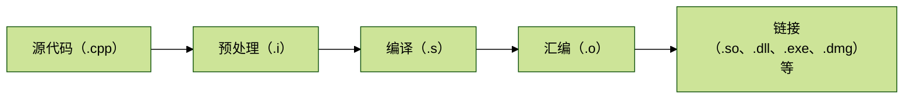
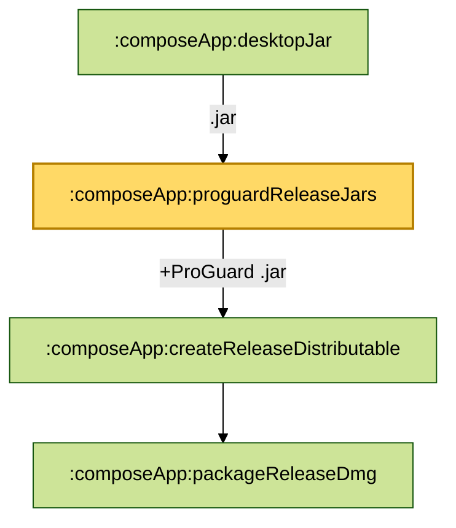
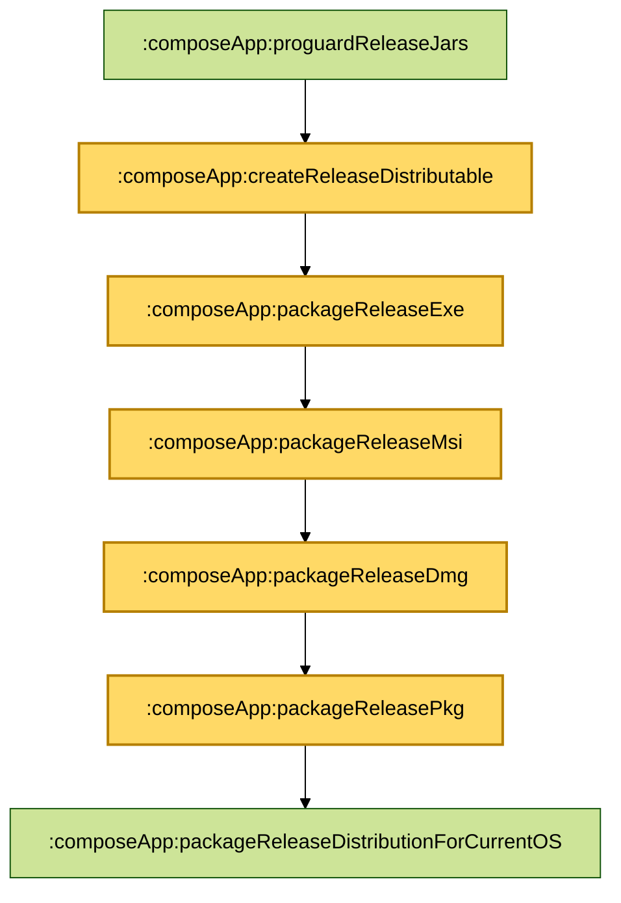
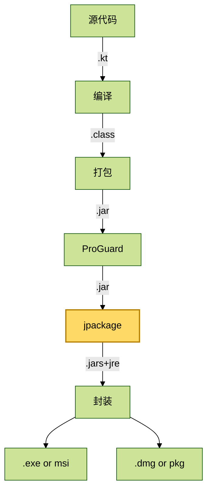

## 前言
最近做了一段时间的 PC 项目，PC 应用程序要实现代码跨 Win 和 Mac 运行，一般使用 C++ 和 Qt 框架：
- C++：使用其标准库通用能力，直接与系统交互，负责处理与平台无关的核心逻辑（算法，音视频编解码等）
- Qt框架：使用其跨平台 UI和跨平台抽象封装能力，负责UI 和系统适配（文件，网络等）

C++ 项目构建流程：

得到产物 `.exe` 和 `.dmg`后就可以上传到官网供用户下载使用。

使用 KMP & CMP 开发桌面 App，也是到产物 `.exe` 和 `.dmg`，但构建流程是：


这里与移动端开发还有一点区别，通常在 Mac 上通过构建工具链就能得到 Android apk 和 iOS ipa，但开发桌面 App，在 Mac 上不能通过构建工具链得到 Win exe 和 Mac dmg。所以需要一台 Win 和 Mac 设备才行。

## 构建
构建相关配置通过在 `build.gradle.kts` 中配置。
### 编译
编译是从`.kt` 源代码到`.class`字节码。

#### jvmToolchain

`jvmToolchain` 用于指定 jdk 版本：

```kotlin
kotlin {
    jvmToolchain(17)
}
```
此时，在 Mac 和 Win 上都必须使用 jdk=17，以及在 CI/CD 中也必须使用 jdk=17。如果 Mac 使用 jdk=17，而 Win 不使用 jdk=17，开发阶段可能不会出现编译错误，但 release 阶段就容易出现编译错误，所以首先需要统一 jdk 版本。

#### commonMainImplementation

有时需要为 Mac 和 Win 在 `commonMain` 添加不同的原生依赖，此时如果在`commonMain.dependencies` 中同时依赖 Mac 和 Win 库：

```kotlin
kotlin {
    jvmToolchain(17)

    sourceSets {

        commonMain.dependencies {
            //Mac
            implementation(libs.skiko.macos)
            //Win
            implementation(libs.skiko.win)
        }
    }
}
```
这样也会出现，在开发阶段不会出现编译错误，在 release 阶段才会出现编译错误，特别是在 Win 上。

要解决这个问题，可以使用 `commonMainImplementation` 将依赖添加到 `commonMain`中：
```kotlin
kotlin {
    jvmToolchain(17)
    jvm("desktop")

    sourceSets {

    }
    macosArm64 {
        dependencies {
            commonMainImplementation(libs.skiko.macos.arm64)
        }
    }
    macosX64 {
        dependencies {
            commonMainImplementation(libs.skiko.macos.x64)
        }
    }
    mingwX64 {
        dependencies {
            commonMainImplementation(libs.skiko.win.x64)
        }
    }
}
```
#### kotlin.srcDir
 
`kotlin.srcDir` 用于指定源代码目录。在开发过程除了标准目录`kotlin.srcDirs("src/commonMain/kotlin")`或 `kotlin.srcDirs("src/desktopMain/kotlin")`外，有时还需要添加自动生成的代码。比如生成的 config 代码：

```kotlin
sourceSets {
    val commonMain by getting {
        kotlin.srcDirs("src/commonMain/kotlin")
        kotlin.srcDir(layout.buildDirectory.dir("generated/config/commonMain"))
        dependencies {

        }
    }
}
```
#### BuildConfig

在 Android 开发中，通过 `buildConfigField` 可以向 `BuildConfig` 类中添加字段，比如在`BuildConfig` 添加应用版本信息：
- VERSION_NAME：版本名称（"1.0.0"）。
- VERSION_CODE：版本代码（10000100）。
- APPLICATION_ID：应用的唯一标识符（com.example.myapplication）。

但 Compose Desktop 时，build.gradle.kts 中没有`buildConfigField`。这就需要自己实现`BuildConfig`，实现的大致思路是：


这里介绍下简单实现方法，如：

```kotlin
sourceSets {
    val commonMain by getting {
        kotlin.srcDirs("src/commonMain/kotlin")
        kotlin.srcDir(layout.buildDirectory.dir("generated/config/commonMain"))
        dependencies {

        }
    }
}
//自定义生成 BuildConfig.kt 的 Gradle Task
val generateBuildConfig by tasks.registering {
    group = "build"
    description = "Generates BuildConfig.kt"
    //生成类目录
    val outputDir = layout.buildDirectory.dir("generated/config/commonMain")
    outputs.dir(outputDir)

    val dir = outputDir.get().asFile
    //读取包名和版本
    val name = project.rootProject.findProperty("PACKAGE_NAME")
    val version = project.rootProject.findProperty("PACKAGE_VERSION")
    //生成类路径
    val configFile = dir.resolve("com/example/myapplication/config/BuildConfig.kt")
    configFile.parentFile.mkdirs()
    configFile.writeText(
        """
            package com.example.myapplication.config

            object BuildConfig {
                const val PACKAGE_NAME = "$name"
                const val PACKAGE_VERSION = "$version"
            }
            """.trimIndent()
    )
}
//添加任务依赖，执行 task: compileKotlinJvm 时，会触发 task: generateBuildConfig
tasks.findByPath("compileKotlinJvm")?.dependsOn(generateBuildConfig)
```
在 gradle.properties 配置：

```
PACKAGE_NAME=com.example.myapplication
PACKAGE_VERSION=1.0.0
```

执行 `./gradlew run` 或 `./gradlew runRelease`，就会生成：

```kotlin
package com.example.myapplication.config

object BuildConfig {
    const val PACKAGE_NAME = "com.example.myapplication"
    const val PACKAGE_VERSION = "1.0.0"
}
```
在代码中使用：

```ktolin
import com.example.myapplication.config.BuildConfig

BuildConfig.PACKAGE_NAME
```

#### mainClass

`mainClass` 用指定 Compose Desktop 应用程序的入口类，应用程序启动会执行该类的 `main` 方法：
```kotlin
Maint.kt

fun main() = application {
    Window(
        onCloseRequest = ::exitApplication,
        title = "${BuildConfig.PACKAGE_NAME} v${BuildConfig.PACKAGE_VERSION}",
        icon = painterResource(Res.drawable.icon)
    ) {
        App()
    }
}
```

在 build.gradle.kts 中配置：
```kotlin
compose.desktop {
    application {
        mainClass = com.example.myapplication.MainKt
        nativeDistributions {
        
        }
    }
}
```
---

### 封装

封装是从`.jar` 到`.exe`或 `.dmg`。

#### buildTypes.release.proguard

在构建 release 版本时（`.jar` &rarr;`.exe`或 `.dmg`阶段），通过`buildTypes.release.proguard`可以启用 ProGuard 混淆、优化等处理。

```kotlin
compose.desktop {
    application {
        mainClass = project.rootProject.findProperty("MAIN_CLASS") as String
        nativeDistributions {
            buildTypes.release.proguard {
                version.set("7.2.2") // 指定 proguard 版本
                isEnabled.set(true) // 启用 proguard 处理
                obfuscate.set(true) // 混淆
                optimize.set(true)  // 优化
                configurationFiles.from(project.file("proguard-rules.pro")) //指定 ProGuard 规则配置文件
            }
        }
    }
}
```
`proguard-rules.pro` 指定规则，如：
```
# Keep all kotlinx.* classes (e.g., kotlinx.serialization, kotlinx.coroutines)
-keep class kotlinx.** { *; }

# Keep all androidx.* classes (Jetpack Compose UI components)
-keep class androidx.** { *; }
```

启用 ProGuard 后， desktopJar 会经过 `proguardReleaseJars` 任务处理：


#### nativeDistributions

`nativeDistributions` 用于指定平台产物，产物名称，产物版本号，平台图标，签名信息等。

```kotlin
compose.desktop {
    application {
        mainClass = project.rootProject.findProperty("MAIN_CLASS") as String
        nativeDistributions {
            targetFormats(TargetFormat.Dmg, TargetFormat.Pkg, TargetFormat.Exe, TargetFormat.Msi)
            packageName = project.rootProject.findProperty("PACKAGE_NAME") as String
            packageVersion = project.rootProject.findProperty("PACKAGE_VERSION") as String
            macOS {
                iconFile.set(project.file("src/commonMain/composeResources/drawable/app_icon_mac.icns"))
                bundleID = project.rootProject.findProperty("BUNDLE_ID") as String
                signing {
                    sign.set(true)
                    identity.set("Developer ID Application: Your Name (TEAMID)")
                }
            }
            windows {
                iconFile.set(project.file("src/commonMain/composeResources/drawable/app_icon_win.ico"))
                menuGroup = project.rootProject.findProperty("MENU_GROUP") as String
                upgradeUuid = project.rootProject.findProperty("UPGRADE_UUID") as String
            }
        }
    }
}
```
- `targetFormats(...)` ：指定生成平台产物，Mac：Dmg，Pkg，Win：Exe，Msi。
- `packageName`：产物名称。
- `packageVersion`：产物版本号。

macOS:
- `iconFile`：指定 app icon，格式必须是 `.icns`。在 Mac 上可以使用 `iconutil` 制作，icon 的大小 1024x1024，为了视觉效果，icon 内容大小建议为 icon大小的80%～90%。
- `bundleID`：唯一标识符，可以采用包名。
- `signing`：签名信息。

windows:
- `iconFile`：指定 app icon，格式必须是 `.ico`。可以使用 python 脚本制作（`from PIL import Image`）。
- `menuGroup`：开始菜单中的目录名称。
- `upgradeUuid`：版本升级唯一标识符，也可以通过 python 脚本生成。如果 uuid 不一样，无法覆盖安装，因为会认为是不同的应用程序。
- 签名：使用微软官方工具[ signtool.exe](https://learn.microsoft.com/en-us/dotnet/framework/tools/signtool-exe)。

#### jpackage

在开发 Compose Desktop 中，最后是 [jpackage](https://docs.oracle.com/en/java/javase/17/docs/specs/man/jpackage.html) 将`.jar`封装成平台产物`.exe`或 `.dmg`。


**jpackage** 参与的任务有：




**jpackage** 的工作原理是：将应用程序 Jars 和 JRE(JVM + Libraries）一起打包，然后封装成平台可执行文件`.exe`或 `.dmg`。所以**在 Win 或 Mac 打开的`.exe`或 `.dmg` 是运行在 JVM 环境中。**


当执行`./gradlew packageReleaseDistributionForCurrentOS --info` 任务时会输出：

```
Starting process 'command '/Users/xxx/Library/Java/JavaVirtualMachines/corretto-17.0.11/Contents/Home/bin/jpackage''. Working directory: /Users/xxx/Public/software/android-workplace/kmp-gitstats/composeApp Command: /Users/xxx/Library/Java/JavaVirtualMachines/corretto-17.0.11/Contents/Home/bin/jpackage @/Users/wangjiang/Public/software/android-workplace/kmp-gitstats/composeApp/build/compose/tmp/createReleaseDistributable.args.txt
Successfully started process 'command '/Users/xxx/Library/Java/JavaVirtualMachines/corretto-17.0.11/Contents/Home/bin/jpackage''
```
在文件`composeApp/build/compose/tmp/createReleaseDistributable.args.txt`中有jpackage 执行的相关命令信息。


### CI/CD
在 CI/CD 中，`.yml` 配置文件首先需要指定 jdk=17。build 阶段时，Mac 和 Win 可以使用 Gradle Task： `./gradlew packageDistributionForCurrentOS`。release 阶段时，Mac 和 Win 可以使用 Gradle Task： `./gradlew packageReleaseDistributionForCurrentOS`。构建产物在`./composeApp/build/compose/binaries`目录下。

例如，gitHub workflows 配置。

`.github/workflows/build.yml`:
```yml
name: Build GitStats Desktop

on:
  push:
    branches: [main]
  pull_request:
    branches: [main]

jobs:
  build-macos:
    runs-on: macos-latest
    steps:
      - uses: actions/checkout@v3

      - name: Set up JDK 17
        uses: actions/setup-java@v3
        with:
          distribution: temurin
          java-version: 17

      - name: Build macOS distribution
        run: ./gradlew packageDistributionForCurrentOS

  build-windows:
    runs-on: windows-latest
    steps:
      - uses: actions/checkout@v3

      - name: Set up JDK 17
        uses: actions/setup-java@v3
        with:
          distribution: temurin
          java-version: 17

      - name: Build Windows distribution
        run: ./gradlew packageDistributionForCurrentOS
```
`.github/workflows/release.yml`:
```yml
name: Build & Release GitStats Desktop

on:
  push:
    branches:
      - main
      - 'release/**'
    tags:
      - 'v*'

jobs:
  build:
    runs-on: ${{ matrix.os }}
    strategy:
      matrix:
        os: [macos-latest, windows-latest]

    steps:
      - uses: actions/checkout@v3

      - name: Set up JDK 17
        uses: actions/setup-java@v3
        with:
          distribution: temurin
          java-version: 17

      - name: Build for ${{ matrix.os }}
        run: ./gradlew packageReleaseDistributionForCurrentOS

      - name: Find generated artifacts
        id: find-package
        run: |
          echo "files=$(find ./composeApp/build/compose/binaries -type f ( -name '*.dmg' -o -name '*.exe' ) | tr '\n' ' ')" >> $GITHUB_OUTPUT
        shell: bash

      - name: Upload to GitHub Release
        uses: softprops/action-gh-release@v1
        with:
          files: ${{ steps.find-package.outputs.files }}
        env:
          GITHUB_TOKEN: ${{ secrets.GITHUB_TOKEN }}
```

## 总结

使用KMP & CMP 开发桌面 App 的构建流程是：



构建产物本地二进制文件`.exe`或 `.dmg`与 Kotlin/Native构建产物本地二进制文件`.exe`或 `.dmg`有本质的不同，前者运行在 Jvm 环境中，后者运行在本地环境中。
